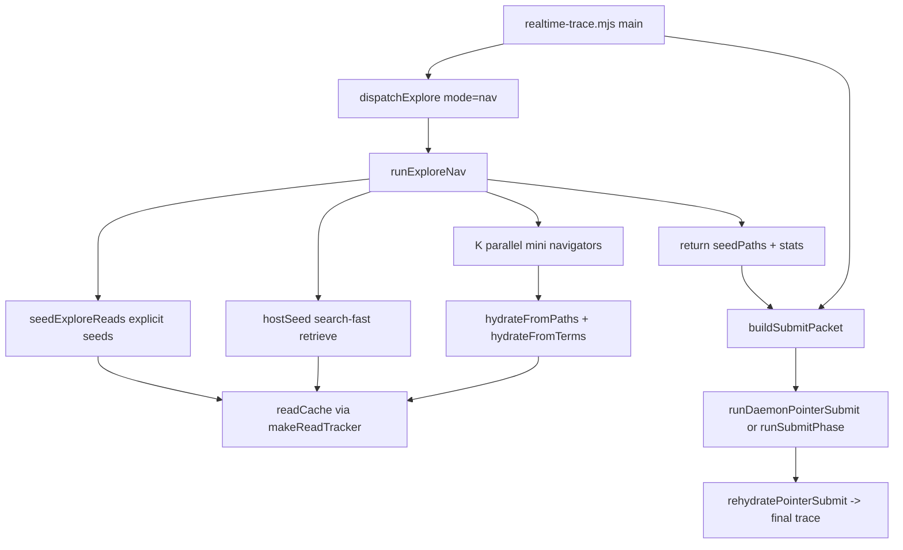

Tracing the nav explore path: searching for seed-file logic and submit-packet construction.
The nav explore path is a two-phase pipeline in `realtime-trace.mjs`: **host-driven seeding + parallel mini navigators** fill a shared `readCache`, then **`buildSubmitPacket`** turns that cache into the prompt the submit model consumes. Here is how those pieces connect.

## End-to-end flow



Default mode is `nav` (`UNITRACE_RT_UNITRACE_MODE`, default `"nav"`). Orchestration lives in `realtime-trace.mjs`:

```997:1033:skills/unitrace/scripts/realtime-trace.mjs
    const exploreStats = await dispatchExplore({
      model,
      ensureSession,
      prompt: explorePrompt,
      question: q,
      mapBlock,
      workspace,
      deadlineMs,
      maxTurns: exploreMaxTurns,
      framesPath,
      filesRead,
      readCache,
      toolLog,
      toolResults,
    });
    // ...
    const { text: submitPacket, orderedPaths } = buildSubmitPacket({
      question: q,
      mapBlock,
      submitInstructions,
      filesRead,
      readCache,
      toolLog,
      seedPaths: exploreStats.seedPaths || [],
      hostPassages: UNITRACE_RT_HOST_PASSAGES,
      pointerIndex: UNITRACE_RT_SUBMIT_POINTER_INDEX,
    });
```

---

## Phase 1: Seeding files

`dispatchExplore` calls `runExploreNav` with a shared `makeReadTracker` callback. Every seed and nav read goes through the same tracker, which maintains a **pinned + recent** excerpt per file so definition windows survive later reads:

```248:271:skills/unitrace/scripts/realtime-trace.mjs
function makeReadTracker(workspace, filesRead, readCache) {
  const pinned = new Map();
  const recent = new Map();
  return (rel, excerpt, opts = {}) => {
    const normalized = normalizeReadPath(workspace, rel);
    if (!normalized) return;
    filesRead.add(normalized);
    if (opts.pin) {
      pinned.set(normalized, clampExcerptHead(mergeExcerpt(pinned.get(normalized), excerpt), READ_EXCERPT_MAX));
    } else {
      recent.set(normalized, clampExcerptTail(mergeExcerpt(recent.get(normalized), excerpt), READ_EXCERPT_MAX));
    }
    // ... merge pin + recent into readCache
    readCache.set(normalized, combined);
  };
}
```

### Step 1a: Explicit seeds (`seedExploreReads`)

`runExploreNav` calls `seedExploreReads` first:

```352:370:skills/unitrace/scripts/lib/rt-explore-nav.mjs
  const explicitSeeds = seedExploreReads({
    workspace,
    question,
    mapBlock,
    filesRead,
    readCache,
    onRead,
  });
  const focusRoots = focusRootsFor(question, explicitSeeds);
  const hostSeeds = await hostSeed(workspace, question, onRead, {
    maxSpans: seedSpans,
    preferSourceOnly,
    focusRoots,
    // ...
  });
  const seedPaths = [...new Set([...explicitSeeds, ...hostSeeds])];
```

`seedExploreReads` in `rt-map-seed.mjs` runs several layers, in priority order:

1. **`grepHitSeeds`** — grep code symbols from the question (snake_case, camelCase, SCREAMING_CASE), score hits for definitions, read a window around each definition, **pin** it.
2. **`curatedTraceSeeds`** — question-pattern templates (e.g. questions mentioning "nav", "seed", "submit packet" get targeted line ranges in `rt-map-seed.mjs`, `rt-explore-nav.mjs`, `realtime-trace.mjs`).
3. **Repo-map line ranges** — `parseMapLineRanges(mapBlock)` scored by `scoreMapRange`, read with padding, pinned.
4. **`deriveSeedPaths`** — named script files from the question, map paths matching identifiers, fallback `scripts/` paths.
5. **`pipelineSeedReads`** — deterministic template reads for known trace pipelines (`rt-pipeline-seed.mjs`).

Budget: `UNITRACE_RT_SEED_MAX` (default 4), plus extra budget for grep hits. Map seeding toggled by `UNITRACE_RT_SEED_FROM_MAP` (default on).

### Step 1b: Host retriever seed (`hostSeed`)

After explicit seeds, `hostSeed` runs `retrieveCandidates` from `search-fast.mjs` — one combined ripgrep, classify/score, AST hydrate — using the full question as the query:

```305:324:skills/unitrace/scripts/lib/rt-explore-nav.mjs
async function hostSeed(workspace, question, onRead, { maxSpans, ... }) {
  const seeded = [];
  result = await retrieveCandidates(workspace, question, { maxSpans, ... });
  for (const c of focusCandidates(result.candidates || [], focusRoots, ...)) {
    // ...
    onRead(rel, readCandidateWindow(workspace, c), { pin: true });
    if (!seeded.includes(rel)) seeded.push(rel);
  }
  return seeded;
}
```

Candidates are filtered by **focus roots** derived from seed paths and named files in the question (`focusRootsFor`), and by archive/wire/test allowlists. Default span budget: `UNITRACE_RT_NAV_SEED_SPANS` (12).

The union `seedPaths = explicitSeeds + hostSeeds` is returned to the submit phase for ordering and priority labeling.

---

## Phase 2: Nav explore rounds

After seeding, `runExploreNav` runs `UNITRACE_RT_NAV_ROUNDS` rounds (default 1) of **K parallel navigators** (default 8, `gpt-realtime-mini`):

```378:418:skills/unitrace/scripts/lib/rt-explore-nav.mjs
  for (let round = 0; round < rounds; round += 1) {
    const indexText = buildNavIndex(readCache, seedPaths, indexFiles);
    const requests = Array.from({ length: navCount }, (_, i) => ({
      system: NAV_INSTRUCTIONS,
      user: navPromptFor(question, indexText, FACETS[i % FACETS.length]),
      schema: NAV_SCHEMA,
      schemaName: "navigate",
    }));
    const results = await daemonAskBatch(namespace, requests, { model: navModel });
    const { terms, paths, allDone } = dedupNavProposals(results);
    hydrateFromPaths(workspace, dedupPaths, onRead, { focusRoots, ... });
    await hydrateFromTerms(workspace, dedupTerms, onRead, { maxSpans: roundSpans, ... });
    if (allDone || (discovered === 0 && round > 0)) break;
  }
```

Each navigator sees a **READ INDEX** built from the current cache (`buildNavIndex` → `orderReadCacheEntries` + `buildReadIndex`), with seed paths ranked first. They return `{ grep_terms, read_paths, done }`. The host hydrates proposals via `toolReadRange` (paths) or another `retrieveCandidates` pass (terms). Mini models never read files directly.

On daemon failure with zero seeds, nav returns `null` and `dispatchExplore` fail-opens to the legacy agentic `explore_exec` loop.

---

## Phase 3: Building the submit packet

After explore, `buildSubmitPacket` assembles the submit-model prompt from explore artifacts:

```630:729:skills/unitrace/scripts/realtime-trace.mjs
function buildSubmitPacket({
  question, mapBlock, submitInstructions, filesRead, readCache, toolLog, seedPaths = [], wire = false,
  hostPassages = false, pointerIndex = false,
}) {
  const orderedEntries = orderReadCacheEntries(readCache, seedPaths);
  const readIndexEntries = buildReadIndexEntries(orderedEntries, { maxFiles: SUBMIT_EXCERPT_FILES + 4 });
  const orderedPaths = readIndexEntries;
  // ...
  // Sections: ORIGINAL QUESTION, FILES READ, HIGH PRIORITY FILES (seedPaths),
  // LIKELY ANCHOR SYMBOLS, TOOL LOG, then either:
  //   - READ INDEX (pointer mode) or READ EXCERPTS (full excerpt mode)
  // Finally: instructions to call submit_trace / submit_pointer / wire submit
  return { text: truncateText(parts.join("\n"), SUBMIT_PACKET_MAX), orderedPaths };
}
```

Key behaviors:

| Piece | Role |
|---|---|
| `orderReadCacheEntries` (`rt-rehydrate-submit.mjs`) | Sorts cache by **seed insertion order**, not alphabetically |
| `seedPaths` | Listed under "HIGH PRIORITY FILES" so the submit model prefers them |
| `extractAnchorSymbols` | Pulls likely function names from ordered excerpts |
| Pointer mode (default) | Sends a slim **READ INDEX** with `[excerpt_index] path (lines N-M)` previews instead of full excerpts; model returns `citation_spans` referencing indices |
| `orderedPaths` | Drives schema validation and later rehydration |
| `SUBMIT_PACKET_MAX` | Caps packet size (default 45k chars) |

Default submit path: **daemon pointer submit** (`runDaemonPointerSubmit`) using `gpt-realtime-2`. The model returns prose + `citation_spans`; the host calls `rehydratePointerSubmit` to turn pointer indices back into `code_passages` from the read cache, then validates and renders markdown. Fail-open to live-session `runSubmitPhase` if the daemon misses.

---

## Important files and functions

| File | Functions | Role |
|---|---|---|
| `realtime-trace.mjs` | `dispatchExplore`, `makeReadTracker`, `buildSubmitPacket`, `runDaemonPointerSubmit` | Orchestration, cache tracking, packet assembly, submit |
| `lib/rt-explore-nav.mjs` | `runExploreNav`, `hostSeed`, `seedExploreReads` caller, `buildNavIndex`, `dedupNavProposals`, `hydrateFromPaths/Terms` | Nav explore loop |
| `lib/rt-map-seed.mjs` | `seedExploreReads`, `grepHitSeeds`, `curatedTraceSeeds`, `deriveSeedPaths` | Question/map-driven seed reads |
| `lib/rt-pipeline-seed.mjs` | `pipelineSeedReads` | Deterministic pipeline template reads |
| `lib/rt-rehydrate-submit.mjs` | `orderReadCacheEntries`, `buildReadIndex`, `rehydratePointerSubmit` | Seed ordering, index rendering, citation rehydration |
| `search-fast.mjs` | `retrieveCandidates` | Host retriever for `hostSeed` and term hydration |

---

## Summary

For your question specifically ("nav explore path seed files and build submit packet"):

1. **Seed** — `seedExploreReads` (grep definitions, curated ranges, map ranges, derived paths, pipeline templates) plus `hostSeed` (`retrieveCandidates` on the question) populate `readCache` via `makeReadTracker`, with definition windows **pinned**.
2. **Explore** — 8 parallel mini navigators propose more reads; host hydrates into the same cache.
3. **Submit packet** — `buildSubmitPacket` orders cache by seed priority, embeds a READ INDEX (pointer mode) or full excerpts, labels high-priority seeded files, and instructs the submit model how to call the submit tool.
4. **Final trace** — Submit model returns pointer citations; `rehydratePointerSubmit` assembles grounded `code_passages` and renders the final structured trace.

The nav path is intentionally a **drop-in** for the older agentic explore loop: it returns the same `{ seedPaths, toolTurnCount, exploreTurns, ... }` shape that `buildSubmitPacket` already expects.
