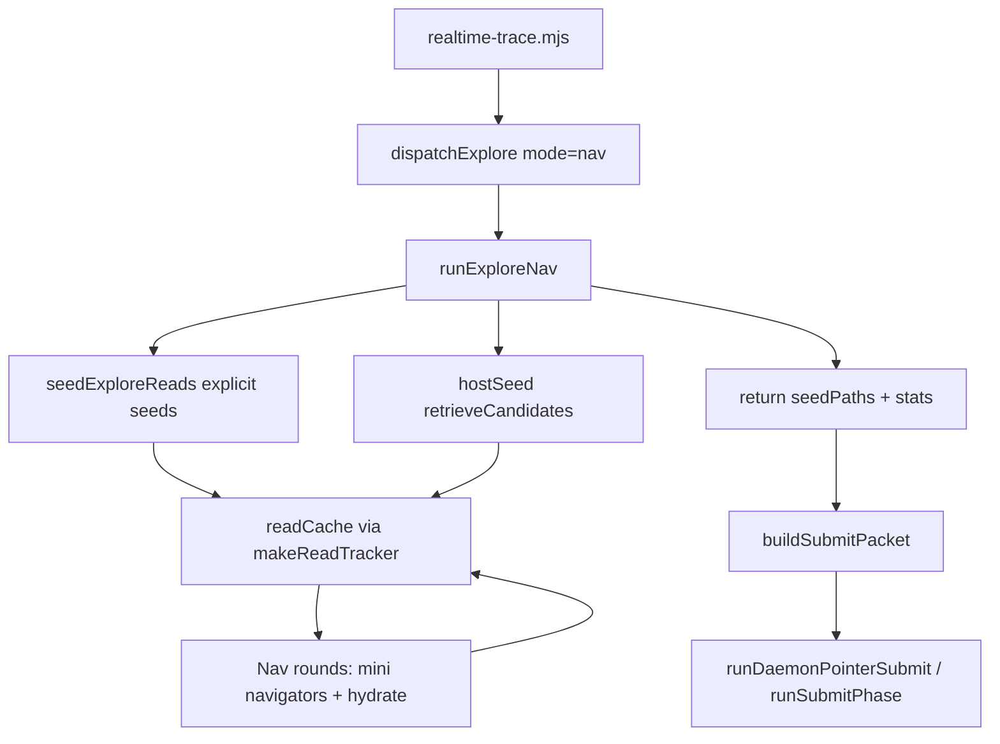

I'll trace the nav explore flow through the codebase—starting with seeding and how the final trace submit packet is assembled.
Next I'll follow how `runExploreNav` connects to seeding and `buildSubmitPacket` in the main trace pipeline.
The **nav explore** path is the default trace explore mode (`UNITRACE_RT_UNITRACE_MODE=nav`). It runs in `realtime-trace.mjs`, seeds the shared read cache on the host, optionally expands coverage via parallel mini navigators, then assembles a submit packet from that cache for the final synthesis step.

## End-to-end flow



Entry: `unitrace.sh` → `trace-rt.sh` → `realtime-trace.mjs`. The main run creates empty `filesRead` / `readCache`, calls `dispatchExplore`, then `buildSubmitPacket` with the explore stats.

```997:1033:skills/unitrace/scripts/realtime-trace.mjs
    const exploreStats = await dispatchExplore({
      model,
      ensureSession,
      prompt: explorePrompt,
      question: q,
      mapBlock,
      workspace,
      deadlineMs,
      maxTurns: exploreMaxTurns,
      framesPath,
      filesRead,
      readCache,
      toolLog,
      toolResults,
    });
    // ...
    const { text: submitPacket, orderedPaths } = buildSubmitPacket({
      question: q,
      mapBlock,
      submitInstructions,
      filesRead,
      readCache,
      toolLog,
      seedPaths: exploreStats.seedPaths || [],
      hostPassages: UNITRACE_RT_HOST_PASSAGES,
      pointerIndex: UNITRACE_RT_SUBMIT_POINTER_INDEX,
    });
```

When mode is `nav`, `dispatchExplore` wires up a read tracker and calls `runExploreNav`:

```584:607:skills/unitrace/scripts/realtime-trace.mjs
  const { workspace, question, mapBlock, filesRead, readCache, toolLog, framesPath } = args;
  const onRead = makeReadTracker(workspace, filesRead, readCache);
  const navStats = await runExploreNav({
    workspace,
    question,
    mapBlock,
    filesRead,
    readCache,
    onRead,
    namespace: UNITRACE_RT_NAMESPACE,
    navModel: UNITRACE_RT_NAV_MODEL,
    debug: Boolean(framesPath),
  });
  // ...
  if (navStats.seedPaths.length) toolLog.push(`seed reads: ${navStats.seedPaths.join(", ")}`);
  toolLog.push(`phase explore_mode=${mode} nav_turns=${navStats.exploreTurns} files_read=${filesRead.size}`);
```

---

## 1. How files get seeded

Seeding is **host-side only** — mini navigators never read the filesystem. Everything goes through `onRead`, which is `makeReadTracker`. That tracker maintains pinned vs recent excerpts per file and writes the merged result into `readCache`:

```244:271:skills/unitrace/scripts/realtime-trace.mjs
function makeReadTracker(workspace, filesRead, readCache) {
  const pinned = new Map();
  const recent = new Map();
  return (rel, excerpt, opts = {}) => {
    const normalized = normalizeReadPath(workspace, rel);
    if (!normalized) return;
    filesRead.add(normalized);

    if (opts.pin) {
      pinned.set(normalized, clampExcerptHead(mergeExcerpt(pinned.get(normalized), excerpt), READ_EXCERPT_MAX));
    } else {
      recent.set(normalized, clampExcerptTail(mergeExcerpt(recent.get(normalized), excerpt), READ_EXCERPT_MAX));
    }
    // ... merge pinned + recent into readCache
    readCache.set(normalized, combined);
  };
}
```

Pinned reads (seeds) stay at the front and survive later truncation.

### Layer A: Explicit map/question seeds (`seedExploreReads`)

`runExploreNav` calls `seedExploreReads` first:

```352:370:skills/unitrace/scripts/lib/rt-explore-nav.mjs
  const explicitSeeds = seedExploreReads({
    workspace,
    question,
    mapBlock,
    filesRead,
    readCache,
    onRead,
  });
  const focusRoots = focusRootsFor(question, explicitSeeds);
  const hostSeeds = await hostSeed(workspace, question, onRead, { ... });
  const seedPaths = [...new Set([...explicitSeeds, ...hostSeeds])];
```

`seedExploreReads` in `rt-map-seed.mjs` runs several strategies in priority order:

1. **`grepHitSeeds`** — grep for code symbols in the question, pick definition hits, read definition windows with `{ pin: true }`.
2. **`curatedTraceSeeds`** — hard-coded line ranges for known trace questions (e.g. submit/render paths in `realtime-trace.mjs`).
3. **Repo map line ranges** — `parseMapLineRanges(mapBlock)` scores ranges against question terms; best per file is read pinned.
4. **`deriveSeedPaths`** — named scripts in the question, map paths matching focus terms, required paths.
5. **`pipelineSeedReads`** — pipeline-specific seeds (e.g. nested unitrace files).

Each read goes through `readSeedSpec` → `toolReadRange` → `onRead(rel, content, { pin: true })` for high-priority seeds.

```334:407:skills/unitrace/scripts/lib/rt-map-seed.mjs
export function seedExploreReads({ workspace, question, mapBlock, filesRead, readCache, onRead, ... }) {
  // Definition-centered seeds FIRST ...
  const grepAdded = grepHitSeeds({ workspace, question, onRead });
  // curated + map ranges + deriveSeedPaths + pipelineSeedReads
  return paths;
}
```

Budget: `UNITRACE_RT_SEED_MAX` (default 4), `UNITRACE_RT_SEED_LINES` (default 120 lines per seed).

### Layer B: Host retriever seeds (`hostSeed`)

After explicit seeds, `hostSeed` runs the same **search-fast** retriever used by fast search:

```305:324:skills/unitrace/scripts/lib/rt-explore-nav.mjs
async function hostSeed(workspace, question, onRead, { maxSpans, preferSourceOnly, focusRoots, ... }) {
  result = await retrieveCandidates(workspace, question, { maxSpans, ...(preferSourceOnly ? { maxDocFiles: 0 } : {}) });
  for (const c of focusCandidates(result.candidates || [], focusRoots, archiveOk, wireOk, testsOk)) {
    onRead(rel, readCandidateWindow(workspace, c), { pin: true });
    if (!seeded.includes(rel)) seeded.push(rel);
  }
  return seeded;
}
```

`retrieveCandidates` (`search-fast.mjs`) does one combined ripgrep over query terms, classifies/scores hits, AST-hydrates spans, and returns ranked candidates. Nav reads a window around each candidate (`readCandidateWindow` → `toolReadRange` or fallback numbered excerpt) and pins it.

Focus filtering (`focusRootsFor`, `focusCandidates`) keeps reads near paths named in the question or already seeded (e.g. under `.../scripts/`). Question heuristics (`prefersSource`, `allowArchive`, `allowWire`, `allowTests`) steer toward source vs docs and gate archive/wire/test paths unless the question asks for them.

Default span budget: `UNITRACE_RT_NAV_SEED_SPANS=12`.

### Returned `seedPaths`

`seedPaths` is the deduped union of explicit + host retriever paths. It is returned from `runExploreNav` and used later for submit ordering and the “HIGH PRIORITY FILES” section.

---

## 2. Nav rounds (post-seed expansion)

After seeding, `runExploreNav` runs up to `UNITRACE_RT_NAV_ROUNDS` (default 1) rounds of **8 parallel `gpt-realtime-mini` navigators** (`UNITRACE_RT_NAV_COUNT=8`):

1. **`buildNavIndex`** — renders current `readCache` as a compact READ INDEX (same builder submit uses).
2. **`daemonAskBatch`** — each navigator gets a distinct facet (entry point, data flow, helpers, config, etc.) and returns `{ grep_terms, read_paths, done }` via `NAV_SCHEMA`.
3. **`dedupNavProposals`** — unions/dedups terms and path+range proposals across navigators.
4. **`hydrateFromPaths`** — direct `toolReadRange` for explicit read requests.
5. **`hydrateFromTerms`** — another `retrieveCandidates` pass for proposed grep terms.

New reads go through `onRead` without `pin` (recent layer). The loop stops when all navigators say `done`, nothing new was found, or `filesRead.size >= maxReads`.

---

## 3. How the submit packet is built

After explore, `buildSubmitPacket` in `realtime-trace.mjs` turns the shared state into the user message for submit synthesis.

### Ordering

```636:640:skills/unitrace/scripts/realtime-trace.mjs
  const orderedEntries = orderReadCacheEntries(readCache, seedPaths);
  const readIndexEntries = buildReadIndexEntries(orderedEntries, {
    maxFiles: SUBMIT_EXCERPT_FILES + 4,
  });
  const orderedPaths = readIndexEntries;
```

`orderReadCacheEntries` (`rt-rehydrate-submit.mjs`) ranks seeded paths first (by seed insertion order), then alphabetically — so definition seeds are not pushed out of capped indexes by later reads.

### Packet sections

`buildSubmitPacket` assembles:

| Section | Source |
|---|---|
| `ORIGINAL QUESTION` | user question |
| `REPO MAP` | compacted `mapBlock` (omitted in pointer-index mode) |
| `FILES READ DURING EXPLORE` | sorted `filesRead` |
| `HIGH PRIORITY FILES` | `seedPaths` from explore |
| `LIKELY ANCHOR SYMBOLS` | `extractAnchorSymbols` from ordered excerpts |
| `TOOL LOG` | last 8 non-phase log lines |
| Evidence body | **pointer index** or **full excerpts** |

Default path uses **pointer index** (`UNITRACE_RT_SUBMIT_POINTER_INDEX=1`, `UNITRACE_RT_HOST_PASSAGES=1`):

```694:715:skills/unitrace/scripts/realtime-trace.mjs
  if (usePointerIndex) {
    parts.push(buildReadIndex(orderedEntries, { maxFiles: SUBMIT_EXCERPT_FILES + 4, previewLines: READ_INDEX_PREVIEW_LINES }), "");
  } else {
    parts.push("READ EXCERPTS:");
    // full numbered excerpts for up to SUBMIT_EXCERPT_FILES files
  }
  // ...
  parts.push(
    `Call ${SUBMIT_POINTER_SCHEMA_NAME} once with prose fields and citation_spans (excerpt_index + line range).`,
    "Do NOT include code_passages or grounding_manifest — host rehydrates citations from READ INDEX.",
  );
```

`buildReadIndex` (`rt-rehydrate-submit.mjs`) emits numbered entries like `[0] path (lines N-M)` plus a short preview — the model cites `excerpt_index` + line ranges, and the host rehydrates verbatim code via `rehydratePointerSubmit`.

The full text is truncated to `UNITRACE_RT_SUBMIT_PACKET_MAX` (default 45,000 chars). Return value: `{ text, orderedPaths }`.

### Submit consumption

The packet goes to:

- **`runDaemonPointerSubmit`** (default) — warm `gpt-realtime-2` daemon pool, pointer schema, host rehydration; or
- **`runSubmitPhase`** — live Realtime session fallback.

Both use `orderedPaths` to map `citation_spans[].excerpt_index` back to file excerpts in `readCache`.

---

## Key files

| Role | File / function |
|---|---|
| Orchestrator | `skills/unitrace/scripts/realtime-trace.mjs` — `dispatchExplore`, `buildSubmitPacket`, `makeReadTracker` |
| Nav explore loop | `skills/unitrace/scripts/lib/rt-explore-nav.mjs` — `runExploreNav`, `hostSeed`, `hydrateFromTerms`, `hydrateFromPaths`, `buildNavIndex` |
| Explicit seeding | `skills/unitrace/scripts/lib/rt-map-seed.mjs` — `seedExploreReads`, `grepHitSeeds`, `readSeedSpec` |
| Retriever | `skills/unitrace/scripts/search-fast.mjs` — `retrieveCandidates` |
| Submit index / rehydration | `skills/unitrace/scripts/lib/rt-rehydrate-submit.mjs` — `orderReadCacheEntries`, `buildReadIndex`, `buildReadIndexEntries`, `rehydratePointerSubmit` |
| File I/O | `skills/unitrace/scripts/lib/htools.mjs` — `toolReadRange`, `confine` |

For your exact question (“nav explore path seed files and build submit packet”), the direct answer paths are `rt-explore-nav.mjs` (seeding + nav) and `realtime-trace.mjs` (`buildSubmitPacket` after `runExploreNav` returns `seedPaths`).
