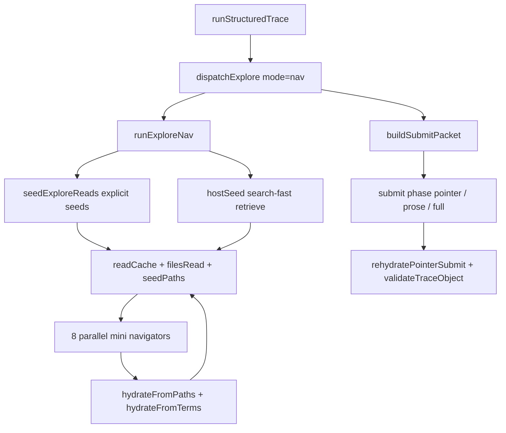

Tracing the nav explore flow: how files are seeded and how the final trace submit packet is assembled.
Checking `retrieveCandidates` and the read tracker to complete the flow:
The **nav explore path** is the default trace explore mode (`UNITRACE_RT_UNITRACE_MODE=nav`). It fills a shared **`readCache` / `filesRead` / `seedPaths`** state during explore, then **`buildSubmitPacket`** turns that state into the text payload the submit model consumes. Orchestration lives in `realtime-trace.mjs`; seeding in `rt-map-seed.mjs` + `rt-explore-nav.mjs`; packet assembly in `buildSubmitPacket` + `rt-rehydrate-submit.mjs`.

---

## End-to-end flow



Explore and submit share one **`makeReadTracker`**-backed cache. Nav reads and seeds all land in the same `readCache` that submit reads.

---

## 1. Entry: nav mode bypasses the agentic loop

When mode is `nav` or `hybrid`, `dispatchExplore` calls `runExploreNav` instead of the full-model `explore_exec` loop:

```587:640:skills/unitrace/scripts/realtime-trace.mjs
async function dispatchExplore({ model, ensureSession, ...args }) {
  const mode = UNITRACE_RT_UNITRACE_MODE;
  if (mode !== "nav" && mode !== "hybrid") {
    // ... agentic path ...
  }

  const { workspace, question, mapBlock, filesRead, readCache, toolLog, framesPath } = args;
  const onRead = makeReadTracker(workspace, filesRead, readCache);
  const navStats = await runExploreNav({
    workspace,
    question,
    mapBlock,
    filesRead,
    readCache,
    onRead,
    // ...
  });
  // ...
}
```

After explore, **`buildSubmitPacket`** runs with `seedPaths` from explore stats:

```1044:1054:skills/unitrace/scripts/realtime-trace.mjs
    const { text: submitPacket, orderedPaths } = buildSubmitPacket({
      question: q,
      mapBlock,
      submitInstructions,
      filesRead,
      readCache,
      toolLog,
      seedPaths: exploreStats.seedPaths || [],
      hostPassages: UNITRACE_RT_HOST_PASSAGES,
      pointerIndex: UNITRACE_RT_SUBMIT_POINTER_INDEX,
    });
```

---

## 2. Shared read state: pinned vs recent excerpts

`makeReadTracker` keeps two layers per file: **pinned** (seed/definition windows) and **recent** (nav reads). Pinned content stays at the front so later reads cannot truncate answer locations:

```257:284:skills/unitrace/scripts/realtime-trace.mjs
function makeReadTracker(workspace, filesRead, readCache) {
  const pinned = new Map();
  const recent = new Map();
  return (rel, excerpt, opts = {}) => {
    const normalized = normalizeReadPath(workspace, rel);
    if (!normalized) return;
    filesRead.add(normalized);

    if (opts.pin) {
      pinned.set(normalized, clampExcerptHead(mergeExcerpt(pinned.get(normalized), excerpt), READ_EXCERPT_MAX));
    } else {
      recent.set(normalized, clampExcerptTail(mergeExcerpt(recent.get(normalized), excerpt), READ_EXCERPT_MAX));
    }
    // ... merge pin + recent into readCache ...
  };
}
```

---

## 3. Seeding phase A: `seedExploreReads` (explicit / map / grep seeds)

`runExploreNav` starts by calling **`seedExploreReads`** from `rt-map-seed.mjs`:

```364:382:skills/unitrace/scripts/lib/rt-explore-nav.mjs
  const explicitSeeds = seedExploreReads({
    workspace,
    question,
    mapBlock,
    filesRead,
    readCache,
    onRead,
  });
  const focusRoots = focusRootsFor(question, explicitSeeds);
  const hostSeeds = await hostSeed(workspace, question, onRead, { /* ... */ });
  const seedPaths = [...new Set([...explicitSeeds, ...hostSeeds])];
```

`seedExploreReads` runs several strategies **in priority order**:

| Step | Function | What it does |
|------|----------|--------------|
| 1 | `grepHitSeeds` | Grep code symbols from the question; find **definitions**; read windows; **`pin: true`** |
| 2 | `curatedTraceSeeds` | Question-regex line ranges (e.g. nav/seed/submit → `rt-map-seed`, `rt-explore-nav`, `buildSubmitPacket`) |
| 3 | `parseMapLineRanges` | Score repo-map line entries; read best span per file; **pinned** |
| 4 | `deriveSeedPaths` | Named scripts, map paths matching identifiers, `scripts/` fallbacks |
| 5 | `pipelineSeedReads` | Deterministic pipeline reads for trace-related questions |

Core loop:

```382:455:skills/unitrace/scripts/lib/rt-map-seed.mjs
export function seedExploreReads({ workspace, question, mapBlock, filesRead, readCache, onRead, ... }) {
  // 1. Definition-centered grep seeds FIRST (own budget, pinned)
  const grepAdded = grepHitSeeds({ workspace, question, onRead });
  // 2. Curated + map ranges (pinned)
  // 3. deriveSeedPaths fallbacks
  // 4. pipelineSeedReads
  return paths;
}
```

For your exact question shape (“seed files” + “submit packet”), **`curatedTraceSeeds`** adds targeted ranges:

```138:150:skills/unitrace/scripts/lib/rt-map-seed.mjs
  const wantsNavSeedSubmit = /\b(nav|seed|submit packet|submit-packet|build submit packet)\b/.test(q);
  if (/\btrace-rt(?:\.sh)?\b|.../ || wantsNavSeedSubmit) {
    // ...
    if (wantsNavSeedSubmit) {
      specs.push({ path: "scripts/lib/rt-map-seed.mjs", start_line: 300, end_line: 390 });
      specs.push({ path: "scripts/lib/rt-explore-nav.mjs", start_line: 294, end_line: 380 });
      specs.push({ path: "scripts/realtime-trace.mjs", start_line: 632, end_line: 715 });
    }
  }
```

---

## 4. Seeding phase B: `hostSeed` (search-fast retriever)

After explicit seeds, **`hostSeed`** runs **`retrieveCandidates`** (`search-fast.mjs`): one combined ripgrep → classify/score → AST hydrate. Results are filtered by **`focusRootsFor`** (directories around seeded/named paths) and written **pinned** into the cache:

```315:336:skills/unitrace/scripts/lib/rt-explore-nav.mjs
async function hostSeed(workspace, question, onRead, { maxSpans, focusRoots, ... }) {
  result = await retrieveCandidates(workspace, question, { maxSpans, ... });
  for (const c of focusCandidates(result.candidates || [], focusRoots, ...)) {
    // ...
    onRead(rel, readCandidateWindow(workspace, c), { pin: true });
    if (!seeded.includes(rel)) seeded.push(rel);
  }
  return seeded;
}
```

Final **`seedPaths`** = union of explicit map/grep seeds + host retriever hits (deduped, order preserved for submit priority).

---

## 5. Nav expansion (optional rounds)

Default: **8 navigators × 1 round** (`UNITRACE_RT_NAV_COUNT=8`, `UNITRACE_RT_NAV_ROUNDS=1`).

Each round:

1. **`buildNavIndex`** — ordered preview of `readCache` (seeds first via `orderReadCacheEntries`)
2. **`daemonAskBatch`** — 8 parallel `gpt-realtime-mini` calls, each with a different **facet** (entrypoint, callees, config, etc.)
3. **`dedupNavProposals`** — union `grep_terms` + `read_paths`
4. **`hydrateFromPaths`** — direct `toolReadRange` for explicit path requests
5. **`hydrateFromTerms`** — another `retrieveCandidates` pass for grep terms

Navigators never read files themselves; the host hydrates everything into the same `readCache`.

---

## 6. Building the submit packet: `buildSubmitPacket`

After explore, **`buildSubmitPacket`** assembles a single text blob (max ~45k chars) for the submit model:

```643:750:skills/unitrace/scripts/realtime-trace.mjs
function buildSubmitPacket({
  question, mapBlock, submitInstructions, filesRead, readCache, toolLog, seedPaths = [],
  hostPassages = false, pointerIndex = false, wire = false,
}) {
  const orderedEntries = orderReadCacheEntries(readCache, seedPaths);
  const readIndexEntries = buildReadIndexEntries(orderedEntries, { maxFiles: SUBMIT_EXCERPT_FILES + 4 });
  const orderedPaths = readIndexEntries;
  const usePointerIndex = pointerIndex && hostPassages && !wire;

  // Sections assembled:
  // - ORIGINAL QUESTION
  // - REPO MAP (skipped in pointer-index mode)
  // - FILES READ DURING EXPLORE
  // - HIGH PRIORITY FILES (seedPaths)
  // - LIKELY ANCHOR SYMBOLS (extracted from excerpts)
  // - QUESTION-SPECIFIC GUIDANCE (for seed+submit questions)
  // - TOOL LOG (last 8 non-phase lines)
  // - READ INDEX (pointer mode) OR READ EXCERPTS (legacy)
  // - submit instruction (submit_pointer_trace / submit_trace_prose / submit_trace)
  return { text: truncateText(parts.join("\n"), SUBMIT_PACKET_MAX), orderedPaths };
}
```

Important helpers in **`rt-rehydrate-submit.mjs`**:

- **`orderReadCacheEntries`** — seeds rank first (grep definitions before alphabetical noise)
- **`buildReadIndex`** — numbered `[0] path (lines X-Y)` + preview for pointer submit
- **`buildReadIndexEntries`** — structured entries with line spans for rehydration

For seed+submit questions, **`questionGuidance`** in `realtime-trace.mjs` nudges the model toward `seedExploreReads`, `runExploreNav`/`hostSeed`, and `buildSubmitPacket`.

---

## 7. Submit phase (consumes the packet)

Default path (pointer index on):

1. Submit model returns **`citation_spans`** referencing `excerpt_index` in the READ INDEX
2. **`rehydratePointerSubmit`** maps spans → **`code_passages`** (AST-clamped, max 5)
3. **`validateTraceObject`** enforces grounding against `filesRead`

Daemon submit (`runDaemonPointerSubmit`) uses the same packet and rehydration path; it fails open to live-session submit on miss/validation failure.

---

## Producer vs consumer summary

| Stage | File | Produces / consumes |
|-------|------|---------------------|
| Explicit seeding | `rt-map-seed.mjs` → `seedExploreReads` | Pinned reads → `readCache`, `filesRead`; returns `seedPaths` |
| Host retriever seed | `rt-explore-nav.mjs` → `hostSeed` | More pinned reads; extends `seedPaths` |
| Nav expansion | `rt-explore-nav.mjs` → `runExploreNav` | Unpinned/pinned reads into same cache |
| Packet assembly | `realtime-trace.mjs` → `buildSubmitPacket` | Consumes `question`, `mapBlock`, `filesRead`, `readCache`, `toolLog`, `seedPaths` → `{ text, orderedPaths }` |
| Citation rehydration | `rt-rehydrate-submit.mjs` | Consumes submit model pointers + `orderedPaths` → full trace object |

---

## Key files

| Role | Path |
|------|------|
| Orchestrator | `skills/unitrace/scripts/realtime-trace.mjs` |
| Map/grep/curated seeding | `skills/unitrace/scripts/lib/rt-map-seed.mjs` |
| Nav loop + host retriever seed | `skills/unitrace/scripts/lib/rt-explore-nav.mjs` |
| Fast retrieve (rg + AST) | `skills/unitrace/scripts/search-fast.mjs` |
| READ INDEX + pointer rehydration | `skills/unitrace/scripts/lib/rt-rehydrate-submit.mjs` |
| Design notes | `skills/unitrace/AGENTS.md` (Trace fast path section) |

The architectural split: **explore is host-driven** (deterministic seeds + mini navigators proposing targets + host reads). **Submit is model-driven** over a pre-built evidence packet, with the host rehydrating citations from the READ INDEX rather than trusting the model to paste code verbatim.
