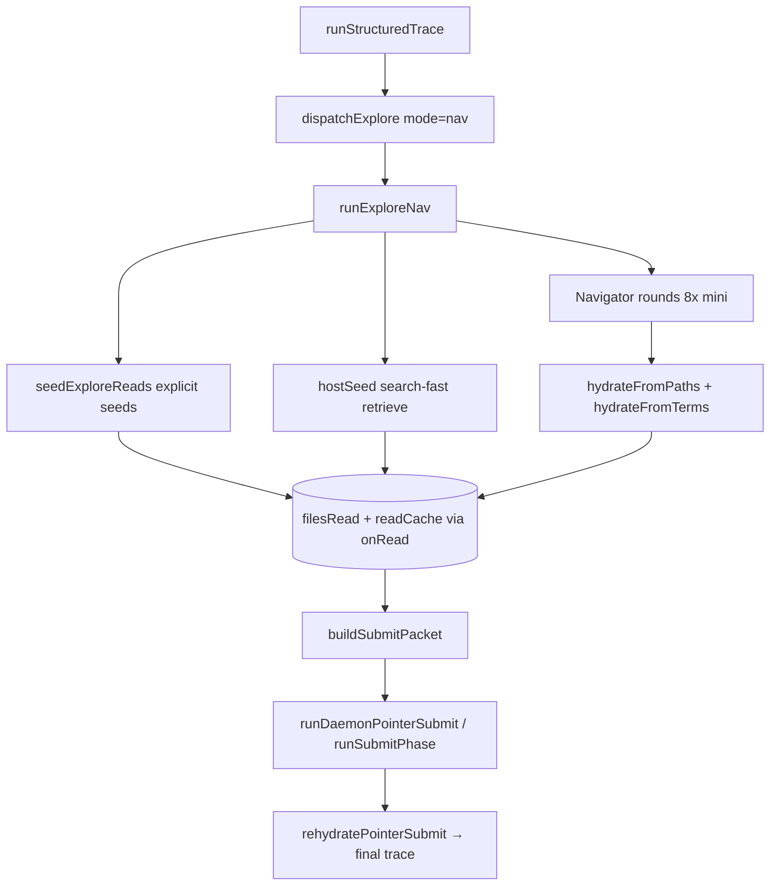

Tracing the nav explore → seed → submit flow in the unitrace scripts.
The **nav explore path** is the default trace explore mode (`UNITRACE_RT_UNITRACE_MODE=nav`). It seeds files into a shared read cache, optionally expands coverage via parallel mini navigators, then **`buildSubmitPacket`** turns that state into the text payload the submit model consumes. Orchestration lives in `realtime-trace.mjs`; seeding logic is split between `rt-map-seed.mjs` and `rt-explore-nav.mjs`.

---

## End-to-end flow



After explore, `runStructuredTrace` calls `buildSubmitPacket` with `seedPaths`, `filesRead`, `readCache`, `toolLog`, `question`, and `mapBlock`, then hands the result to the submit phase:

```1044:1054:skills/unitrace/scripts/realtime-trace.mjs
    const { text: submitPacket, orderedPaths } = buildSubmitPacket({
      question: q,
      mapBlock,
      submitInstructions,
      filesRead,
      readCache,
      toolLog,
      seedPaths: exploreStats.seedPaths || [],
      hostPassages: UNITRACE_RT_HOST_PASSAGES,
      pointerIndex: UNITRACE_RT_SUBMIT_POINTER_INDEX,
    });
```

Nav mode is selected in `dispatchExplore`:

```587:609:skills/unitrace/scripts/realtime-trace.mjs
async function dispatchExplore({ model, ensureSession, ...args }) {
  const mode = UNITRACE_RT_UNITRACE_MODE;
  if (mode !== "nav" && mode !== "hybrid") {
    // ... agentic path ...
  }

  const { workspace, question, mapBlock, filesRead, readCache, toolLog, framesPath } = args;
  const onRead = makeReadTracker(workspace, filesRead, readCache);
  const navStats = await runExploreNav({
    workspace,
    question,
    mapBlock,
    filesRead,
    readCache,
    onRead,
    // ...
  });
```

---

## Phase 1: How nav seeds files

All reads go through **`onRead`**, which is `makeReadTracker` — a two-layer cache with **pinned** (seed/definition windows) and **recent** (later exploration) excerpts, merged into `readCache` and tracked in `filesRead`:

```257:284:skills/unitrace/scripts/realtime-trace.mjs
function makeReadTracker(workspace, filesRead, readCache) {
  const pinned = new Map();
  const recent = new Map();
  return (rel, excerpt, opts = {}) => {
    const normalized = normalizeReadPath(workspace, rel);
    if (!normalized) return;
    filesRead.add(normalized);

    if (opts.pin) {
      pinned.set(normalized, clampExcerptHead(mergeExcerpt(pinned.get(normalized), excerpt), READ_EXCERPT_MAX));
    } else {
      recent.set(normalized, clampExcerptTail(mergeExcerpt(recent.get(normalized), excerpt), READ_EXCERPT_MAX));
    }
    // ... merge pinned + recent into readCache ...
  };
}
```

### Step 1a — Explicit seeds: `seedExploreReads`

`runExploreNav` calls this first:

```364:382:skills/unitrace/scripts/lib/rt-explore-nav.mjs
  const explicitSeeds = seedExploreReads({
    workspace,
    question,
    mapBlock,
    filesRead,
    readCache,
    onRead,
  });
  const focusRoots = focusRootsFor(question, explicitSeeds);
  const hostSeeds = await hostSeed(workspace, question, onRead, { /* ... */ });
  const seedPaths = [...new Set([...explicitSeeds, ...hostSeeds])];
```

`seedExploreReads` (`rt-map-seed.mjs`) runs several seeding strategies in priority order:

1. **`grepHitSeeds`** — grep for code symbols in the question (camelCase, snake_case, SCREAMING_CASE), pick definition hits, read a window around each, **pin** them.
2. **`curatedTraceSeeds`** — question-pattern shortcuts (e.g. nav/seed/submit questions get `rt-map-seed.mjs`, `rt-explore-nav.mjs`, and `buildSubmitPacket` line ranges in `realtime-trace.mjs`).
3. **Repo map line ranges** — `parseMapLineRanges` + scoring via `scoreMapRange`, read best span per file, pinned.
4. **`deriveSeedPaths`** — named scripts from the question + map paths matching focus terms.
5. **`pipelineSeedReads`** — pipeline-specific seeds from `rt-pipeline-seed.mjs`.

Core loop:

```382:455:skills/unitrace/scripts/lib/rt-map-seed.mjs
export function seedExploreReads({ workspace, question, mapBlock, filesRead, readCache, onRead, ... }) {
  // 1. grepHitSeeds (own budget, pinned)
  const grepAdded = grepHitSeeds({ workspace, question, onRead });
  // 2. curatedTraceSeeds + map ranges (pinned)
  // 3. deriveSeedPaths
  // 4. pipelineSeedReads
  return paths;
}
```

Reads use `toolReadRange` from `htools.mjs` (workspace-confined, optional preamble stripping).

### Step 1b — Host retriever seed: `hostSeed`

After explicit seeds, `hostSeed` runs **`retrieveCandidates`** from `search-fast.mjs` on the full question text — one combined ripgrep, classify/score, AST hydrate — then reads each candidate window and **pins** it:

```315:336:skills/unitrace/scripts/lib/rt-explore-nav.mjs
async function hostSeed(workspace, question, onRead, { maxSpans, preferSourceOnly, focusRoots, ... }) {
  result = await retrieveCandidates(workspace, question, { maxSpans, ...(preferSourceOnly ? { maxDocFiles: 0 } : {}) });
  for (const c of focusCandidates(result.candidates || [], focusRoots, ...)) {
    onRead(rel, readCandidateWindow(workspace, c), { pin: true });
    if (!seeded.includes(rel)) seeded.push(rel);
  }
  return seeded;
}
```

Default span budgets: `UNITRACE_RT_NAV_SEED_SPANS=12` for host seed, `UNITRACE_RT_NAV_ROUND_SPANS=8` per nav round.

`focusRootsFor` narrows candidates to directories implied by named/seeded paths (e.g. `skills/unitrace/scripts/`).

### Step 2 — Navigator expansion (optional breadth)

For `UNITRACE_RT_NAV_ROUNDS` (default 1), the host:

1. Builds a **READ INDEX** preview via `buildNavIndex` → `orderReadCacheEntries` + `buildReadIndex`.
2. Fans out **8 parallel** `gpt-realtime-mini` navigators (`daemonAskBatch`) with distinct facet prompts (`FACETS`).
3. Each returns `{ grep_terms, read_paths, done }` per `NAV_SCHEMA`.
4. **`dedupNavProposals`** unions proposals.
5. Host hydrates:
   - **`hydrateFromPaths`** — direct `toolReadRange` on explicit path/range requests.
   - **`hydrateFromTerms`** — another `retrieveCandidates` pass on joined grep terms.

Nav reads are **not** pinned (unless they overlap seed windows), so they fill the “recent” layer without evicting pinned definition windows.

---

## Phase 2: How the submit packet is built

`buildSubmitPacket` in `realtime-trace.mjs` assembles a single text blob for the submit model. Key steps:

### Ordering and index construction

```648:654:skills/unitrace/scripts/realtime-trace.mjs
  const readFiles = [...filesRead].sort();
  const orderedEntries = orderReadCacheEntries(readCache, seedPaths);
  const readIndexEntries = buildReadIndexEntries(orderedEntries, {
    maxFiles: SUBMIT_EXCERPT_FILES + 4,
  });
  const orderedPaths = readIndexEntries;
```

- **`orderReadCacheEntries`** (`rt-rehydrate-submit.mjs`) sorts by **seed insertion order first**, then alphabetically — so grep/curated seeds stay at the front of the capped index.
- **`buildReadIndexEntries`** splits pinned/recent segments (`---` separators) into separate index entries with line spans.

### Packet sections (default pointer-index mode)

When `UNITRACE_RT_SUBMIT_POINTER_INDEX=1` and `UNITRACE_RT_HOST_PASSAGES=1` (defaults):

| Section | Content |
|---------|---------|
| ORIGINAL QUESTION | Raw question |
| FILES READ DURING EXPLORE | All paths in `filesRead` |
| HIGH PRIORITY FILES | `seedPaths` from explore |
| LIKELY ANCHOR SYMBOLS | Exported functions/classes extracted from excerpts |
| QUESTION-SPECIFIC GUIDANCE | e.g. seed+submit questions get extra steering |
| TOOL LOG | Last 8 non-phase log lines |
| READ INDEX | `[0] path (lines X-Y)` + preview lines; model cites `excerpt_index` |
| Submit instruction | Call `submit_pointer_trace` with `citation_spans`, not full code |

Relevant assembly:

```659:746:skills/unitrace/scripts/realtime-trace.mjs
  const parts = ["ORIGINAL QUESTION:", question, "", ...];
  if (seedPaths.length) {
    parts.push("HIGH PRIORITY FILES (seeded because they are likely load-bearing...)", seedPaths.join("\n"), ...);
  }
  // ...
  if (usePointerIndex) {
    parts.push(buildReadIndex(orderedEntries, { maxFiles: SUBMIT_EXCERPT_FILES + 4, previewLines: READ_INDEX_PREVIEW_LINES }), "");
    parts.push(`Call ${SUBMIT_POINTER_SCHEMA_NAME} once with prose fields and citation_spans...`);
  }
  return { text: truncateText(parts.join("\n"), SUBMIT_PACKET_MAX), orderedPaths };
```

The packet is capped at **`UNITRACE_RT_SUBMIT_PACKET_MAX`** (default 45,000 chars). Repo map is **omitted** in pointer-index mode (orientation comes from READ INDEX instead).

### Submit phase consumption

1. Submit model returns prose + **`citation_spans`** referencing READ INDEX indices.
2. **`rehydratePointerSubmit`** (`rt-rehydrate-submit.mjs`) maps spans → `code_passages` (AST-clamped line ranges from disk).
3. **`validateTraceObject`** checks grounding against `filesRead`.
4. **`renderTraceStructured`** produces final markdown.

Daemon submit (`runDaemonPointerSubmit`) uses the same packet and rehydration path, failing open to live session on miss.

---

## Producer vs consumer boundary

| Stage | Produces | Consumes |
|-------|----------|----------|
| `seedExploreReads` | Initial `seedPaths`, pinned entries in `readCache`/`filesRead` | Question, repo map, workspace |
| `hostSeed` + nav hydration | More reads in same cache; expanded `seedPaths` union | Question, focus roots, nav proposals |
| `buildSubmitPacket` | `{ text, orderedPaths }` submit payload | `question`, `mapBlock`, `filesRead`, `readCache`, `toolLog`, `seedPaths` |
| Submit + rehydrate | Final structured trace + markdown | Submit packet, `orderedPaths`, `readCache` |

For questions about “seed files” and “build submit packet,” `questionGuidance` and `repairQuestionSpecificTrace` in `rt-rehydrate-submit.mjs` explicitly steer the model toward **`seedExploreReads` → `runExploreNav`/`hostSeed` → `buildSubmitPacket`** rather than downstream rendering/wire paths.

---

## Important files and functions

| File | Role |
|------|------|
| `skills/unitrace/scripts/realtime-trace.mjs` | Orchestrator: `dispatchExplore`, `makeReadTracker`, **`buildSubmitPacket`**, submit phases |
| `skills/unitrace/scripts/lib/rt-explore-nav.mjs` | **`runExploreNav`**, `hostSeed`, `hydrateFromTerms`/`hydrateFromPaths`, `buildNavIndex`, `dedupNavProposals` |
| `skills/unitrace/scripts/lib/rt-map-seed.mjs` | **`seedExploreReads`**, `grepHitSeeds`, `curatedTraceSeeds`, `deriveSeedPaths` |
| `skills/unitrace/scripts/search-fast.mjs` | **`retrieveCandidates`** (rg → classify → AST hydrate) |
| `skills/unitrace/scripts/lib/rt-rehydrate-submit.mjs` | **`orderReadCacheEntries`**, **`buildReadIndex`**, **`buildReadIndexEntries`**, **`rehydratePointerSubmit`** |
| `skills/unitrace/scripts/lib/htools.mjs` | `toolReadRange`, `toolGrep`, workspace confinement |
| `skills/unitrace/AGENTS.md` | Documents nav defaults (8 navigators, 1 round, daemon submit) |

The nav path is designed as a **drop-in** for the legacy agentic explore loop: it returns the same `{ seedPaths, toolTurnCount, exploreTurns, ... }` shape that `buildSubmitPacket` and `runSubmitPhase` already expect, with all file content landing in one shared `readCache` the submit phase reads from.
