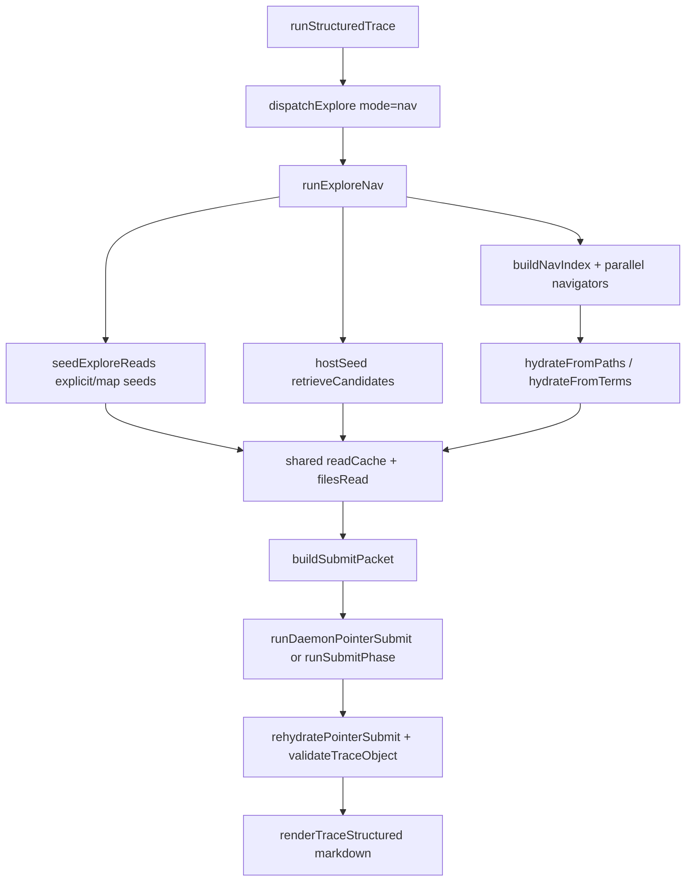

Tracing the nav explore path: searching for seed and submit-packet logic in the unitrace scripts.
Checking how `retrieveCandidates` works and how the orchestrator wires explore to submit:
The nav explore path is a two-phase pipeline in `realtime-trace.mjs`: **explore** fills shared `filesRead` / `readCache` state, then **submit** turns that state into a text packet the model uses to produce the final trace. The default explore mode is `nav` (`UNITRACE_RT_UNITRACE_MODE`, default `"nav"`).

## End-to-end flow



---

## 1. Orchestration entry

`runStructuredTrace` creates empty `filesRead` and `readCache`, runs explore via `dispatchExplore`, then builds and sends the submit packet:

```1017:1054:skills/unitrace/scripts/realtime-trace.mjs
    const exploreStats = await dispatchExplore({
      model,
      ensureSession,
      prompt: explorePrompt,
      question: q,
      mapBlock,
      workspace,
      deadlineMs,
      maxTurns: exploreMaxTurns,
      framesPath,
      filesRead,
      readCache,
      toolLog,
      toolResults,
    });
    // ...
    const { text: submitPacket, orderedPaths } = buildSubmitPacket({
      question: q,
      mapBlock,
      submitInstructions,
      filesRead,
      readCache,
      toolLog,
      seedPaths: exploreStats.seedPaths || [],
      hostPassages: UNITRACE_RT_HOST_PASSAGES,
      pointerIndex: UNITRACE_RT_SUBMIT_POINTER_INDEX,
    });
```

When mode is `nav`, `dispatchExplore` calls `runExploreNav` with a shared `onRead` tracker (`makeReadTracker`) so all reads land in the same cache the submit phase consumes:

```587:620:skills/unitrace/scripts/realtime-trace.mjs
async function dispatchExplore({ model, ensureSession, ...args }) {
  const mode = UNITRACE_RT_UNITRACE_MODE;
  // ...
  const { workspace, question, mapBlock, filesRead, readCache, toolLog, framesPath } = args;
  const onRead = makeReadTracker(workspace, filesRead, readCache);
  const navStats = await runExploreNav({
    workspace,
    question,
    mapBlock,
    filesRead,
    readCache,
    onRead,
    namespace: UNITRACE_RT_NAMESPACE,
    navModel: UNITRACE_RT_NAV_MODEL,
    debug: Boolean(framesPath),
  });
```

`makeReadTracker` maintains pinned vs recent excerpts per file so definition windows from seeding survive later reads:

```257:284:skills/unitrace/scripts/realtime-trace.mjs
function makeReadTracker(workspace, filesRead, readCache) {
  const pinned = new Map();
  const recent = new Map();
  return (rel, excerpt, opts = {}) => {
    const normalized = normalizeReadPath(workspace, rel);
    if (!normalized) return;
    filesRead.add(normalized);
    if (opts.pin) {
      pinned.set(normalized, clampExcerptHead(mergeExcerpt(pinned.get(normalized), excerpt), READ_EXCERPT_MAX));
    } else {
      recent.set(normalized, clampExcerptTail(mergeExcerpt(recent.get(normalized), excerpt), READ_EXCERPT_MAX));
    }
    // ... merges pinned + recent into readCache
    readCache.set(normalized, combined);
  };
}
```

---

## 2. Seeding files (two layers)

Seeding happens inside `runExploreNav` in two passes, then optionally expands via navigators.

### Layer A: `seedExploreReads` (map/question-driven, deterministic)

```364:382:skills/unitrace/scripts/lib/rt-explore-nav.mjs
  const explicitSeeds = seedExploreReads({
    workspace,
    question,
    mapBlock,
    filesRead,
    readCache,
    onRead,
  });
  const focusRoots = focusRootsFor(question, explicitSeeds);
  const hostSeeds = await hostSeed(workspace, question, onRead, {
    maxSpans: seedSpans,
    preferSourceOnly,
    focusRoots,
    // ...
  });
  const seedPaths = [...new Set([...explicitSeeds, ...hostSeeds])];
```

`seedExploreReads` in `rt-map-seed.mjs` runs several strategies in priority order:

1. **`grepHitSeeds`** — grep code symbols from the question, pick definition hits, read windows with `{ pin: true }`.
2. **`curatedTraceSeeds`** — for nav/seed/submit questions, pins specific line ranges (e.g. `rt-map-seed.mjs`, `rt-explore-nav.mjs`, `buildSubmitPacket` in `realtime-trace.mjs`).
3. **Repo map line ranges** — `parseMapLineRanges` + scoring via `scoreMapRange`.
4. **`deriveSeedPaths`** — paths from question filenames + map paths matching focus terms.
5. **`pipelineSeedReads`** — template reads for trace/submit/render questions.

Core entry:

```352:425:skills/unitrace/scripts/lib/rt-map-seed.mjs
export function seedExploreReads({
  workspace,
  question,
  mapBlock,
  filesRead,
  readCache,
  onRead,
  max = envInt("UNITRACE_RT_SEED_MAX", 4),
  lines = envInt("UNITRACE_RT_SEED_LINES", 120),
}) {
  // grepHitSeeds first (pinned definition windows)
  const grepAdded = grepHitSeeds({ workspace, question, onRead });
  // curatedTraceSeeds + map ranges + deriveSeedPaths + pipelineSeedReads
  // ...
  return paths;
}
```

For questions about seeding + submit packets specifically, curated seeds include the three load-bearing files:

```138:150:skills/unitrace/scripts/lib/rt-map-seed.mjs
  const wantsNavSeedSubmit = /\b(nav|seed|submit packet|submit-packet|build submit packet)\b/.test(q);
  // ...
    if (wantsNavSeedSubmit) {
      specs.push({ path: "scripts/lib/rt-map-seed.mjs", start_line: 300, end_line: 390 });
      specs.push({ path: "scripts/lib/rt-explore-nav.mjs", start_line: 294, end_line: 380 });
      specs.push({ path: "scripts/realtime-trace.mjs", start_line: 632, end_line: 715 });
    }
```

Each read goes through `readSeedSpec` → `toolReadRange` → `onRead(rel, content, { pin: true })` for pinned seeds.

### Layer B: `hostSeed` (search-fast retriever)

After explicit seeds, `hostSeed` runs one `retrieveCandidates` pass over the full question:

```317:336:skills/unitrace/scripts/lib/rt-explore-nav.mjs
async function hostSeed(workspace, question, onRead, { maxSpans, ... }) {
  result = await retrieveCandidates(workspace, question, {
    maxSpans,
    ...(preferSourceOnly ? { maxDocFiles: 0 } : {}),
  });
  for (const c of focusCandidates(result.candidates || [], focusRoots, ...)) {
    onRead(rel, readCandidateWindow(workspace, c), { pin: true });
    if (!seeded.includes(rel)) seeded.push(rel);
  }
  return seeded;
}
```

`retrieveCandidates` (`search-fast.mjs`) does: extract symbols/words → one combined ripgrep → classify/score hits → AST-hydrate spans into ranked candidates. Nav uses `UNITRACE_RT_NAV_SEED_SPANS` (default 12) spans.

`focusRootsFor` and `focusCandidates` narrow reads to directories around named/seeded files and suppress downstream transport files for seed+submit questions (`suppressDownstream`).

### Layer C: Navigator expansion (optional, default 1 round × 8 navigators)

After seeding, navigators see a compact READ INDEX and propose more reads:

```390:431:skills/unitrace/scripts/lib/rt-explore-nav.mjs
  for (let round = 0; round < rounds; round += 1) {
    const indexText = buildNavIndex(readCache, seedPaths, indexFiles);
    const results = await daemonAskBatch(namespace, requests, { model: navModel });
    const { terms, paths, allDone } = dedupNavProposals(results);
    const fromPaths = hydrateFromPaths(workspace, dedupPaths, onRead, ...);
    const fromTerms = await hydrateFromTerms(workspace, dedupTerms, onRead, { maxSpans: roundSpans, ... });
```

- **`buildNavIndex`** reuses `orderReadCacheEntries` + `buildReadIndex` from `rt-rehydrate-submit.mjs`.
- **`hydrateFromTerms`** calls `retrieveCandidates` again on navigator grep terms.
- **`hydrateFromPaths`** does direct `toolReadRange` on explicit path/range proposals.

`runExploreNav` returns `{ seedPaths, toolTurnCount, exploreTurns, ... }` — the same shape agentic explore uses.

---

## 3. Building the submit packet

`buildSubmitPacket` in `realtime-trace.mjs` assembles the text the submit model receives. It does **not** run the model; it formats evidence.

Key steps:

```643:750:skills/unitrace/scripts/realtime-trace.mjs
function buildSubmitPacket({
  question, mapBlock, submitInstructions, filesRead, readCache, toolLog, seedPaths = [], ...
}) {
  const orderedEntries = orderReadCacheEntries(readCache, seedPaths);
  const readIndexEntries = buildReadIndexEntries(orderedEntries, {
    maxFiles: SUBMIT_EXCERPT_FILES + 4,
  });
  const orderedPaths = readIndexEntries;
  const usePointerIndex = pointerIndex && hostPassages && !wire;
  // sections: ORIGINAL QUESTION, FILES READ, HIGH PRIORITY FILES (seedPaths),
  // LIKELY ANCHOR SYMBOLS, QUESTION-SPECIFIC GUIDANCE, TOOL LOG,
  // then either READ INDEX (pointer mode) or READ EXCERPTS (legacy)
  return { text: truncateText(parts.join("\n"), SUBMIT_PACKET_MAX), orderedPaths };
}
```

Important pieces:

| Section | Source | Purpose |
|---------|--------|---------|
| `FILES READ DURING EXPLORE` | `filesRead` Set | Grounding manifest / enum |
| `HIGH PRIORITY FILES` | `seedPaths` from explore | Tells submit model which files were intentionally seeded |
| `READ INDEX` (default) | `buildReadIndex(orderedEntries)` | Pointer submit: model returns `citation_spans` with `excerpt_index` |
| `READ EXCERPT` (fallback) | first N entries from `readCache` | Full excerpt mode |
| `orderedPaths` | `buildReadIndexEntries` | Maps index → path + line span for rehydration |

**Ordering matters:** `orderReadCacheEntries` ranks by `seedPaths` insertion order (grep/curated seeds first), not alphabetically:

```39:51:skills/unitrace/scripts/lib/rt-rehydrate-submit.mjs
export function orderReadCacheEntries(readCache, seedPaths = []) {
  const rank = new Map();
  seedPaths.forEach((p, i) => { if (!rank.has(p)) rank.set(p, i); });
  return [...readCache.entries()].sort(([a], [b]) => {
    const ra = rankOf(a);
    const rb = rankOf(b);
    if (ra !== rb) return ra - rb;
    return a.localeCompare(b);
  });
}
```

For seed+submit questions, `questionGuidance` injects explicit hints to focus on `seedExploreReads`, `runExploreNav`/`hostSeed`, and `buildSubmitPacket`.

Default submit path uses **pointer index** (`UNITRACE_RT_SUBMIT_POINTER_INDEX=1`): the packet tells the model to call `submit_trace_pointer` with `citation_spans`, not full code.

---

## 4. Final trace (submit phase, not the packet itself)

After `buildSubmitPacket`:

1. **Daemon path (default):** `runDaemonPointerSubmit` sends the packet to the warm daemon pool.
2. **Fallback:** `runSubmitPhase` over a live Realtime session.

Both call `rehydratePointerSubmit`, which turns pointer citations into `code_passages` by slicing the read index / disk:

```819:829:skills/unitrace/scripts/realtime-trace.mjs
    if (usePointerIndex) {
      parsed = rehydratePointerSubmit({
        pointer: parsed,
        orderedPaths,
        workspace,
        filesRead,
        readCache,
        toolTurns,
        seedPaths,
        question,
      });
```

For seed+submit questions, `rehydratePointerSubmit` also has `repairQuestionSpecificTrace` / `ensureQuestionCoverage` to guarantee passages from the three core files even if the model's citations are thin.

Finally: `validateTraceObject` → `renderTraceStructured` → markdown output.

---

## Producer vs consumer boundary (the handoff you asked about)

| Stage | File / function | What it produces |
|-------|-----------------|------------------|
| Explicit seed | `rt-map-seed.mjs` → `seedExploreReads` | Pinned reads + `seedPaths[]` |
| Retriever seed | `rt-explore-nav.mjs` → `hostSeed` | More pinned reads, merged into `seedPaths` |
| Nav expansion | `rt-explore-nav.mjs` → navigators + hydrate* | Unpinned reads added to same `readCache` |
| Shared state | `makeReadTracker` | `filesRead` Set + `readCache` Map |
| Packet assembly | `realtime-trace.mjs` → `buildSubmitPacket` | `{ text, orderedPaths }` submit payload |
| Trace synthesis | `runDaemonPointerSubmit` / `runSubmitPhase` | Structured JSON trace |
| Citation fill | `rt-rehydrate-submit.mjs` → `rehydratePointerSubmit` | Full trace with `code_passages` |

The critical design point: **explore only writes into `filesRead`, `readCache`, and `seedPaths`; submit only reads that state** (plus `question`, `mapBlock`, `toolLog`) via `buildSubmitPacket`. Navigators never read files themselves — the host executes all I/O through `htools` (`toolReadRange`, `retrieveCandidates`).

---

## Key files referenced

- **`skills/unitrace/scripts/realtime-trace.mjs`** — orchestrator; `dispatchExplore`, `buildSubmitPacket`, `makeReadTracker`, submit phases
- **`skills/unitrace/scripts/lib/rt-explore-nav.mjs`** — nav explore loop; `runExploreNav`, `hostSeed`, `buildNavIndex`, hydration helpers
- **`skills/unitrace/scripts/lib/rt-map-seed.mjs`** — deterministic seeding; `seedExploreReads`, `grepHitSeeds`, `curatedTraceSeeds`
- **`skills/unitrace/scripts/search-fast.mjs`** — `retrieveCandidates` (combined rg → score → AST hydrate)
- **`skills/unitrace/scripts/lib/rt-rehydrate-submit.mjs`** — `orderReadCacheEntries`, `buildReadIndex`, `rehydratePointerSubmit`
- **`skills/unitrace/scripts/lib/rt-pipeline-seed.mjs`** — template pipeline reads appended by `seedExploreReads`
- **`skills/unitrace/scripts/search-seed.mjs`** — shared `codeSymbolIdents` used for focus/scoring (not the RT search seed injection path)
