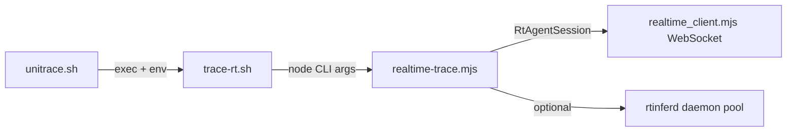

Tracing how `unitrace.sh` connects to the realtime tracer by locating the script and following its call chain.
`unitrace.sh` is a thin entry wrapper. The realtime tracer is the **gpt-realtime-2 WebSocket pipeline** in `trace-rt.sh` → `realtime-trace.mjs` → `lib/realtime_client.mjs`. Handoff happens in three layers.

## End-to-end flow



---

### 1. `unitrace.sh` → `trace-rt.sh`

`unitrace.sh` does not talk to the Realtime API. It sets trace-specific reasoning defaults and **replaces itself** with `trace-rt.sh`:

```12:15:skills/unitrace/scripts/unitrace.sh
exec env \
  UNITRACE_RT_UNITRACE_REASONING_EFFORT="${UNITRACE_RT_UNITRACE_REASONING_EFFORT:-none}" \
  UNITRACE_RT_SUBMIT_REASONING_EFFORT="${UNITRACE_RT_SUBMIT_REASONING_EFFORT:-low}" \
  "$SCRIPT_DIR/trace-rt.sh" "$@"
```

- Explore: reasoning omitted + steer (`none`)
- Submit: reasoning `low`
- The quoted question is passed through unchanged (`"$@"`)

---

### 2. `trace-rt.sh` → `realtime-trace.mjs`

`trace-rt.sh` is the shell orchestrator. Before invoking Node it:

1. **Preflight** — requires `node`, Codex OAuth at `~/.codex/auth.json`, a quoted question (no flags after the question).
2. **Run layout** — creates an isolated run dir under `~/.cache/explore/runs` (or `UNITRACE_RUNS_DIR`), writes `status.json`, `running`, etc.
3. **Recursion guard** — sets `UNITRACE_INSIDE_TRACE_DAEMON=1` so nested trace calls are blocked.
4. **Prompt assembly** — builds explore + submit prompt text, optionally prefetches a repo map via `map.mjs` (`UNITRACE_MAP_MODE`, default `tandem`), writes them to temp files.
5. **Node invocation** — calls `realtime-trace.mjs` with file paths and metadata:

```378:397:skills/unitrace/scripts/trace-rt.sh
RT_ARGS=(
  --prompt-file "$PROMPT_FILE"
  --map-file "$MAP_FILE"
  --question "$QUESTION"
  --workspace "$WORKSPACE"
  --out "$TMP_OUT"
  --raw "$TMP_RAW"
  --err "$ERR_FILE"
  --model "$MODEL"
  --auth-path "$CODEX_AUTH"
  --frames "$RUN_DIR/frames.ndjson"
)

RT_ARGS+=(--submit-prompt-file "$SUBMIT_PROMPT_FILE" --structured-out "$STRUCTURED_JSON")
...
node "$SCRIPT_DIR/realtime-trace.mjs" "${RT_ARGS[@]}" || trace_status=$?
```

After Node exits, the shell copies output to `out.md`, updates status, and optionally hydrates citations (`explore-hydrate.sh`).

Important functions/files in this layer:
- `trace-rt.sh` — `write_status`, `print_done`, prompt/map prep, Node spawn
- `map.mjs` — repo map prefetch
- `explore-hydrate.sh` — post-run citation expansion

---

### 3. `realtime-trace.mjs` — the realtime tracer core

`main()` reads the prompt files and calls `runStructuredTrace()` (default structured path):

```1233:1292:skills/unitrace/scripts/realtime-trace.mjs
async function main() {
  const promptFile = argValue("--prompt-file");
  ...
  const explorePrompt = readFileSync(promptFile, "utf8");
  const submitInstructions = submitPromptFile ? readFileSync(submitPromptFile, "utf8") : "";
  ...
  result = await runStructuredTrace({
    explorePrompt,
    submitInstructions,
    question,
    mapBlock: mapBlockFromFile,
    workspace,
    model,
    authPath,
    ...
  });
```

`runStructuredTrace()` runs two phases:

#### Phase A — Explore (gather evidence)

```978:1037:skills/unitrace/scripts/realtime-trace.mjs
async function runStructuredTrace({ ... }) {
  ...
  if (UNITRACE_RT_DAEMON) {
    warmDaemonPool(UNITRACE_RT_NAMESPACE, undefined, { model: UNITRACE_RT_SYNTH_MODEL }).catch(() => {});
    ...
  }
  ...
  const exploreStats = await dispatchExplore({
    model,
    ensureSession,
    prompt: explorePrompt,
    question: q,
    mapBlock,
    workspace,
    ...
    filesRead,
    readCache,
    toolLog,
    toolResults,
  });
```

`dispatchExplore()` (default mode `nav`) chooses the explore strategy:

```587:618:skills/unitrace/scripts/realtime-trace.mjs
async function dispatchExplore({ model, ensureSession, ...args }) {
  const mode = UNITRACE_RT_UNITRACE_MODE;
  if (mode !== "nav" && mode !== "hybrid") {
    if (UNITRACE_RT_DAEMON) {
      const daemonStats = await runExplorePhaseDaemon(model, args);
      if (daemonStats) return daemonStats;
    }
    return runExplorePhaseSession(await ensureSession(), args);
  }

  const navStats = await runExploreNav({ ... });
  if (!navStats) {
    ...
    return runExplorePhaseSession(await ensureSession(), args);
  }
```

Default **`nav`** path (`lib/rt-explore-nav.mjs`):
- Host seeds reads from the repo map / search-fast retriever
- 8 parallel `gpt-realtime-mini` navigators over the warm daemon pool propose grep/read targets
- Host greps and reads files into `readCache`
- Fail-open to **`agentic`** (`runExplorePhaseSession`) if nav or daemon is unavailable

**Agentic** path uses a live Realtime WebSocket session:
- `RtAgentSession.connect()` → `RealtimeConnection` in `lib/realtime_client.mjs`
- `session.prewarm(session.update)` configures tools + reasoning
- Model calls `explore_exec` in a tool loop; host runs grep/read via `lib/rt-tools.mjs`

#### Phase B — Submit (structured trace)

After explore, `buildSubmitPacket()` assembles a submit packet from `readCache` and tool logs. Submit tries, in order:

1. **Daemon submit** — `runDaemonPointerSubmit()` via `lib/daemon-client.mjs` (warm `gpt-realtime-2` pool, namespace `"trace"`)
2. **Live-session submit** — `runSubmitPhase()` → `askStructured()` on the Realtime socket
3. Validation + optional reask via `lib/trace-schema.mjs`
4. Markdown rendering via `lib/render-trace-structured.mjs`

```1085:1127:skills/unitrace/scripts/realtime-trace.mjs
    if (UNITRACE_RT_DAEMON && usePointerSubmit) {
      const daemonResult = await runDaemonPointerSubmit({ ... });
      if (daemonResult) {
        ...
        return { text: daemonResult.markdown, toolLog, structured: daemonResult.structured };
      }
    }

    const submitSession = await ensureSession();
    structured = await runSubmitPhase(submitSession.connection, { ... });
    ...
    const markdown = renderTraceStructured(workspace, structured);
    return { text: markdown, toolLog, structured };
```

---

### 4. Where the WebSocket actually connects

The Realtime transport lives in `lib/realtime_client.mjs`:

- Reads/refreshes Codex OAuth from `~/.codex/auth.json`
- Opens RFC6455 WebSocket to `api.openai.com/v1/realtime`
- Default model: `gpt-realtime-2`

`lib/rt-agent-session.mjs` wraps that connection for the agent loop: connect, prewarm, hot-socket reuse, `conversation.item.delete` pruning before submit, reconnect on drop.

---

## Summary table

| Step | File | What happens |
|------|------|--------------|
| 1 | `unitrace.sh` | Sets explore/submit reasoning env; `exec trace-rt.sh` |
| 2 | `trace-rt.sh` | Auth check, run dir, map prefetch, write prompt files |
| 3 | `trace-rt.sh` | `node realtime-trace.mjs --prompt-file ... --auth-path ...` |
| 4 | `realtime-trace.mjs` | `runStructuredTrace`: explore → submit → markdown |
| 5 | `rt-explore-nav.mjs` / `runExplorePhaseSession` | Gather file evidence (daemon nav or live WS loop) |
| 6 | `realtime_client.mjs` | Codex OAuth + Realtime WebSocket to gpt-realtime-2 |
| 7 | `trace-rt.sh` | Write `out.md`, status, print result |

So the handoff from `unitrace.sh` to the realtime tracer is: **env-tuned `exec` → shell prep and file-based IPC → `realtime-trace.mjs` orchestrating explore + submit over the Realtime WebSocket (direct session and/or warm daemon pool)**.
