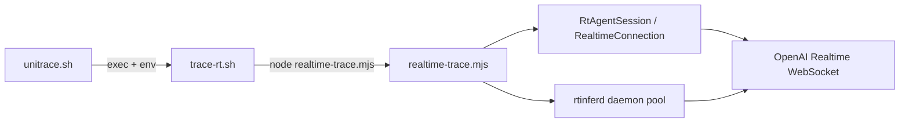

Tracing `unitrace.sh` through the codebase to find where it delegates to the realtime tracer.
`unitrace.sh` does not talk to the Realtime API itself. It is a thin entrypoint that **`exec`s into `trace-rt.sh`**, and `trace-rt.sh` is the shell orchestrator that prepares prompts/state and **`node`s `realtime-trace.mjs`**, which runs the actual gpt-realtime-2 explore + submit pipeline over WebSocket (direct session and/or the warm `rtinferd` daemon pool).

## Handoff chain



### 1. `unitrace.sh` → `trace-rt.sh`

`unitrace.sh` is only a default-config wrapper. It replaces the current process with `trace-rt.sh`, passing through all CLI args and pinning two reasoning-effort defaults:

```12:15:skills/unitrace/scripts/unitrace.sh
exec env \
  UNITRACE_RT_UNITRACE_REASONING_EFFORT="${UNITRACE_RT_UNITRACE_REASONING_EFFORT:-none}" \
  UNITRACE_RT_SUBMIT_REASONING_EFFORT="${UNITRACE_RT_SUBMIT_REASONING_EFFORT:-low}" \
  "$SCRIPT_DIR/trace-rt.sh" "$@"
```

- **Explore:** `none` → omit reasoning + steer (fast silent reading)
- **Submit:** `low` → structured synthesis with light reasoning

Everything else (model, workspace, map mode, nav vs agentic explore, etc.) uses `trace-rt.sh` / `realtime-trace.mjs` defaults unless you override env vars.

### 2. `trace-rt.sh` — shell prep, then invoke Node

`trace-rt.sh` owns the user-facing shell contract:

| Step | What happens |
|------|----------------|
| Guardrails | Rejects `--flags`, blocks recursive use inside trace daemon (`UNITRACE_INSIDE_TRACE_DAEMON=1`) |
| Preflight | Requires `node`, Codex OAuth at `~/.codex/auth.json` |
| Run layout | Creates isolated run dir under `~/.cache/explore/runs` (or `UNITRACE_RUNS_DIR`) with `out.md`, `err.log`, `frames.ndjson`, etc. |
| Map prefetch | Runs `map.mjs` (default mode `tandem`) to build a repo map injected into the explore prompt |
| Prompt assembly | Writes explore + submit instruction files to a temp work dir |
| **Handoff** | Builds CLI args and runs `node realtime-trace.mjs ...` |

Key preflight and model selection:

```199:214:skills/unitrace/scripts/trace-rt.sh
command -v node >/dev/null 2>&1 || { echo "error: node not found on PATH" >&2; exit 127; }

CODEX_AUTH="${UNITRACE_CODEX_AUTH_PATH:-${HOME:-$(cd ~ && pwd)}/.codex/auth.json}"
if [ ! -f "$CODEX_AUTH" ]; then
  printf 'error: Codex auth not found at %s\n' "$CODEX_AUTH" >&2
  printf '  run: codex login\n' >&2
  exit 1
fi

QUESTION="$*"
MODEL="${UNITRACE_RT_MODEL:-gpt-realtime-2}"
WORKSPACE="${UNITRACE_WORKSPACE:-$PWD}"
WORKSPACE="$(abs_path "$WORKSPACE")"
export UNITRACE_WORKSPACE="$WORKSPACE"
export UNITRACE_INSIDE_TRACE_DAEMON=1
```

The actual handoff to the tracer:

```378:397:skills/unitrace/scripts/trace-rt.sh
RT_ARGS=(
  --prompt-file "$PROMPT_FILE"
  --map-file "$MAP_FILE"
  --question "$QUESTION"
  --workspace "$WORKSPACE"
  --out "$TMP_OUT"
  --raw "$TMP_RAW"
  --err "$ERR_FILE"
  --model "$MODEL"
  --auth-path "$CODEX_AUTH"
  --frames "$RUN_DIR/frames.ndjson"
)

RT_ARGS+=(--submit-prompt-file "$SUBMIT_PROMPT_FILE" --structured-out "$STRUCTURED_JSON")
if [ "${UNITRACE_WIRE_FORMAT:-0}" = "1" ]; then
  RT_ARGS+=(--wire 1)
fi

trace_status=0
node "$SCRIPT_DIR/realtime-trace.mjs" "${RT_ARGS[@]}" || trace_status=$?
```

On success, `trace-rt.sh` moves temp output into `out.md`, writes `done`, and prints the trace to stdout. On failure it surfaces `err.log`.

### 3. `realtime-trace.mjs` — two-phase Realtime trace

`main()` parses the CLI args from `trace-rt.sh`, reads the prompt files, and dispatches either `runStructuredTrace()` (default) or `runWireStructuredTrace()`:

```1233:1293:skills/unitrace/scripts/realtime-trace.mjs
async function main() {
  const promptFile = argValue("--prompt-file");
  ...
  const explorePrompt = readFileSync(promptFile, "utf8");
  const submitInstructions = submitPromptFile ? readFileSync(submitPromptFile, "utf8") : "";
  ...
  try {
    if (wire) {
      result = await runWireStructuredTrace({ ... });
    } else {
      result = await runStructuredTrace({ ... });
    }
  } catch (e) { ... }
  ...
}
```

`runStructuredTrace()` is the core pipeline:

1. **Warm daemon pool** (fail-open) for nav mini-model and submit synth model
2. **Explore phase** via `dispatchExplore()`
3. **Submit phase** via daemon pointer submit, with live-session fallback
4. **Render** structured JSON → markdown via `renderTraceStructured()`

```978:1127:skills/unitrace/scripts/realtime-trace.mjs
async function runStructuredTrace({ ... }) {
  ...
  if (UNITRACE_RT_DAEMON) {
    warmDaemonPool(UNITRACE_RT_NAMESPACE, undefined, { model: UNITRACE_RT_SYNTH_MODEL }).catch(() => {});
    ...
  }
  ...
  const exploreStats = await dispatchExplore({ model, ensureSession, prompt: explorePrompt, ... });
  ...
  if (UNITRACE_RT_DAEMON && usePointerSubmit) {
    const daemonResult = await runDaemonPointerSubmit({ ... });
    if (daemonResult) return { text: daemonResult.markdown, toolLog, structured: daemonResult.structured };
  }
  const submitSession = await ensureSession();
  structured = await runSubmitPhase(submitSession.connection, { ... });
  const markdown = renderTraceStructured(workspace, structured);
  return { text: markdown, toolLog, structured };
}
```

#### Explore routing (`dispatchExplore`)

Default mode is **`nav`** (`UNITRACE_RT_UNITRACE_MODE`, default `nav`):

```587:640:skills/unitrace/scripts/realtime-trace.mjs
async function dispatchExplore({ model, ensureSession, ...args }) {
  const mode = UNITRACE_RT_UNITRACE_MODE;
  if (mode !== "nav" && mode !== "hybrid") {
    if (UNITRACE_RT_DAEMON) {
      const daemonStats = await runExplorePhaseDaemon(model, args);
      if (daemonStats) return daemonStats;
    }
    return runExplorePhaseSession(await ensureSession(), args);
  }

  const navStats = await runExploreNav({ workspace, question, mapBlock, ... });
  if (!navStats) {
    toolLog.push("phase explore_mode=nav_failopen->agentic");
    ...
  }
  ...
  return navStats;
}
```

- **`nav` (default):** host-driven fast path in `lib/rt-explore-nav.mjs` — seeds reads, fans out parallel `gpt-realtime-mini` navigators over the daemon pool, host greps/reads into a shared `readCache`
- **`agentic`:** full `explore_exec` tool loop on a live Realtime session (or via `rtinferd` first)
- **`hybrid`:** nav + optional one-turn agentic top-up if coverage is thin

#### Live Realtime session

When a direct WebSocket session is needed, `ensureSession()` creates `RtAgentSession`, which wraps `RealtimeConnection`:

```1003:1012:skills/unitrace/scripts/realtime-trace.mjs
const ensureSession = async () => {
  if (session) return session;
  session = new RtAgentSession({ model, authPath, framesPath });
  await session.connect();
  ...
  return session;
};
```

```16:34:skills/unitrace/scripts/lib/rt-agent-session.mjs
export class RtAgentSession {
  constructor({ model, authPath, framesPath = null } = {}) {
    ...
    this.conn = new RealtimeConnection({ model, authPathOverride: authPath });
  }
  async connect() {
    await this.conn.connect();
    this.alive = true;
    return this;
  }
}
```

`RealtimeConnection` in `lib/realtime_client.mjs` opens the RFC6455 WebSocket to `api.openai.com/v1/realtime`, using Codex OAuth tokens from `~/.codex/auth.json` (refreshing as needed).

## End-to-end for your question

For *"How does unitrace.sh hand off to the realtime tracer?"*, the runtime path is:

1. **`skills/unitrace/scripts/unitrace.sh`** — `exec trace-rt.sh` with explore reasoning `none`, submit `low`
2. **`skills/unitrace/scripts/trace-rt.sh`** — auth check, run dir, `map.mjs` prefetch, write prompt files, **`node realtime-trace.mjs`**
3. **`skills/unitrace/scripts/realtime-trace.mjs`** — explore (default `runExploreNav` via daemon) + submit (`runDaemonPointerSubmit` → `askStructured` over Realtime) → markdown output
4. **`skills/unitrace/scripts/lib/realtime_client.mjs`** — low-level WebSocket + OAuth
5. **`skills/unitrace/scripts/lib/daemon-client.mjs`** — optional warm-pool routing through shared `rtinferd` (fail-open to live session)

## Important files / functions

| Role | File | Key symbols |
|------|------|-------------|
| User entry | `skills/unitrace/scripts/unitrace.sh` | `exec trace-rt.sh` |
| Shell orchestrator | `skills/unitrace/scripts/trace-rt.sh` | preflight, `map.mjs`, `node realtime-trace.mjs` |
| Trace engine | `skills/unitrace/scripts/realtime-trace.mjs` | `main`, `runStructuredTrace`, `dispatchExplore`, `runSubmitPhase` |
| Nav explore | `skills/unitrace/scripts/lib/rt-explore-nav.mjs` | `runExploreNav` |
| WebSocket client | `skills/unitrace/scripts/lib/realtime_client.mjs` | `RealtimeConnection`, `askStructured` |
| Session reuse | `skills/unitrace/scripts/lib/rt-agent-session.mjs` | `RtAgentSession` |
| Daemon pool | `skills/unitrace/scripts/lib/daemon-client.mjs` | `warmDaemonPool`, `daemonAsk` |
| Submit/rehydrate | `skills/unitrace/scripts/lib/rt-rehydrate-submit.mjs` | `runDaemonPointerSubmit`, `rehydratePointerSubmit` |
| Architecture docs | `skills/unitrace/scripts/AGENTS.md`, `skills/unitrace/AGENTS.md` | entrypoint table, fast-path defaults |

In short: **`unitrace.sh` only sets default reasoning env and delegates to `trace-rt.sh`; the realtime tracer is `realtime-trace.mjs`, launched by `trace-rt.sh` with file-based prompts and run-state paths, and it drives gpt-realtime-2 over WebSocket (directly or via the warm daemon pool) through explore-then-submit phases.**
