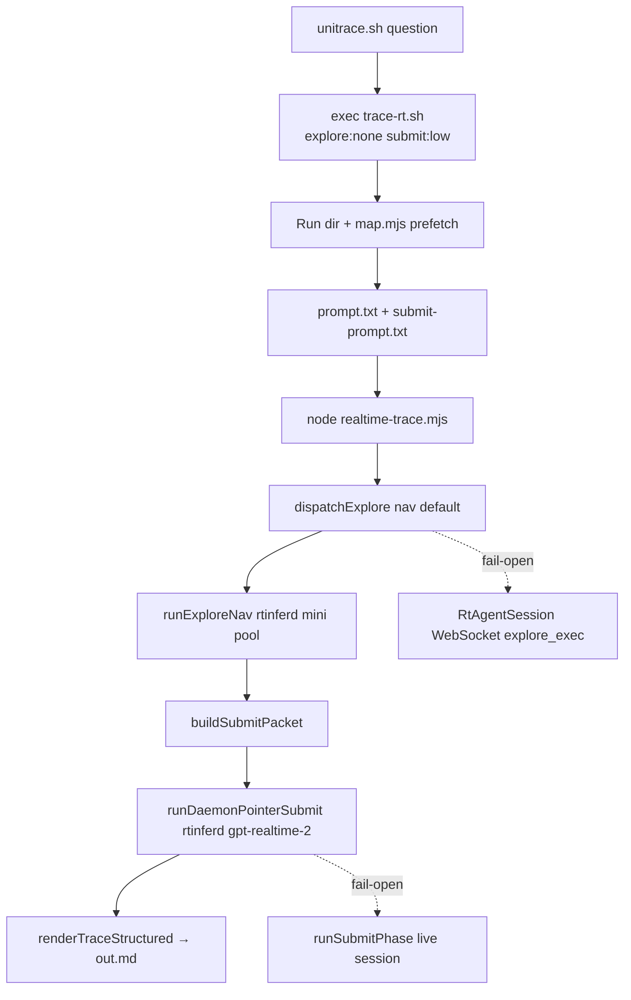

Tracing how `unitrace.sh` connects to the realtime tracer by searching the codebase for the handoff path.
`unitrace.sh` is a thin wrapper. The realtime work happens in `trace-rt.sh` (shell orchestration) and `realtime-trace.mjs` (Node + WebSocket). The chain is:

**`unitrace.sh` → `trace-rt.sh` → `realtime-trace.mjs` → Realtime WebSocket (`gpt-realtime-2`)**

---

## 1. `unitrace.sh`: env defaults + exec into `trace-rt.sh`

`unitrace.sh` does not talk to the Realtime API itself. It sets two reasoning-effort defaults and replaces itself with `trace-rt.sh`, forwarding the question unchanged:

```12:15:skills/unitrace/scripts/unitrace.sh
exec env \
  UNITRACE_RT_UNITRACE_REASONING_EFFORT="${UNITRACE_RT_UNITRACE_REASONING_EFFORT:-none}" \
  UNITRACE_RT_SUBMIT_REASONING_EFFORT="${UNITRACE_RT_SUBMIT_REASONING_EFFORT:-low}" \
  "$SCRIPT_DIR/trace-rt.sh" "$@"
```

- **Explore:** `none` → omit the `reasoning` field and use steer text (fast nav/explore).
- **Submit:** `low` → structured synthesis with light reasoning.

Everything else (model, timeout, explore mode, daemon pool, etc.) uses `trace-rt.sh` / `realtime-trace.mjs` defaults unless you override env vars.

---

## 2. `trace-rt.sh`: run layout, prompts, map prefetch, then spawn Node

`trace-rt.sh` is the shell orchestrator. For a quoted question it:

1. **Validates** — requires `node`, Codex OAuth at `~/.codex/auth.json`, rejects flags after the question.
2. **Creates an isolated run directory** under `~/.cache/explore/runs/<run_id>/` (or `UNITRACE_RUNS_DIR`).
3. **Builds explore + submit prompt files** in a temp work dir (explore instructions, submit schema rules, the question).
4. **Prefetches a repo map** via `map.mjs` (default mode `tandem`), optionally compacts it, and appends it to the explore prompt.
5. **Invokes the realtime tracer** — the actual handoff:

```378:397:skills/unitrace/scripts/trace-rt.sh
RT_ARGS=(
  --prompt-file "$PROMPT_FILE"
  --map-file "$MAP_FILE"
  --question "$QUESTION"
  --workspace "$WORKSPACE"
  --out "$TMP_OUT"
  --raw "$TMP_RAW"
  --err "$ERR_FILE"
  --model "$MODEL"
  --auth-path "$CODEX_AUTH"
  --frames "$RUN_DIR/frames.ndjson"
)

RT_ARGS+=(--submit-prompt-file "$SUBMIT_PROMPT_FILE" --structured-out "$STRUCTURED_JSON")
if [ "${UNITRACE_WIRE_FORMAT:-0}" = "1" ]; then
  RT_ARGS+=(--wire 1)
fi

trace_status=0
node "$SCRIPT_DIR/realtime-trace.mjs" "${RT_ARGS[@]}" || trace_status=$?
```

Notable setup before that call:

- `MODEL` defaults to `gpt-realtime-2` (`UNITRACE_RT_MODEL`).
- `WORKSPACE` defaults to `$PWD` and is exported as `UNITRACE_WORKSPACE`.
- `UNITRACE_INSIDE_TRACE_DAEMON=1` is exported so nested trace calls from inside the daemon are blocked.
- On success, output moves from temp files to `$RUN_DIR/out.md`; optional wire-format hydration runs via `explore-hydrate.sh`.

---

## 3. `realtime-trace.mjs`: CLI entry and two-phase pipeline

`main()` reads the files and flags from `trace-rt.sh`, then runs the structured trace pipeline (default, non-wire):

```1233:1293:skills/unitrace/scripts/realtime-trace.mjs
async function main() {
  const promptFile = argValue("--prompt-file");
  ...
  const explorePrompt = readFileSync(promptFile, "utf8");
  const submitInstructions = submitPromptFile ? readFileSync(submitPromptFile, "utf8") : "";
  ...
  try {
    if (wire) {
      result = await runWireStructuredTrace({ ... });
    } else {
      result = await runStructuredTrace({ ... });
    }
  } catch (e) { ... }
  ...
}
```

`runStructuredTrace()` is the core orchestrator:

| Phase | What happens |
|--------|----------------|
| **Warm pool** | `warmDaemonPool()` for submit (and nav model if different) — no-op shim; `rtinferd` owns the warm socket pool |
| **Explore** | `dispatchExplore()` — default mode `nav` via `runExploreNav()` |
| **Submit packet** | `buildSubmitPacket()` from read cache + tool log |
| **Submit** | Prefer `runDaemonPointerSubmit()` via `rtinferd`; fall back to live-session `runSubmitPhase()` |
| **Render** | `renderTraceStructured()` → markdown written to `--out` |

Explore routing in `dispatchExplore()`:

```587:640:skills/unitrace/scripts/realtime-trace.mjs
async function dispatchExplore({ model, ensureSession, ...args }) {
  const mode = UNITRACE_RT_UNITRACE_MODE;
  if (mode !== "nav" && mode !== "hybrid") {
    if (UNITRACE_RT_DAEMON) {
      const daemonStats = await runExplorePhaseDaemon(model, args);
      if (daemonStats) return daemonStats;
    }
    return runExplorePhaseSession(await ensureSession(), args);
  }

  const navStats = await runExploreNav({ ... });
  if (!navStats) {
    toolLog.push("phase explore_mode=nav_failopen->agentic");
    ...
  }
  ...
}
```

Default **`nav`** mode: host-side seeding + 8 parallel `gpt-realtime-mini` navigators (`lib/rt-explore-nav.mjs`) over the daemon pool; the host greps/reads files into a `readCache`. If nav fails, it falls back to the agentic `explore_exec` loop on a live Realtime session.

Reasoning effort from `unitrace.sh` is consumed here:

```161:168:skills/unitrace/scripts/realtime-trace.mjs
const UNITRACE_RT_UNITRACE_REASONING_EFFORT =
  process.env.UNITRACE_RT_UNITRACE_REASONING_EFFORT
  || process.env.UNITRACE_RT_REASONING_EFFORT
  || DEFAULT_UNITRACE_REASONING_EFFORT;
const UNITRACE_RT_SUBMIT_REASONING_EFFORT =
  process.env.UNITRACE_RT_SUBMIT_REASONING_EFFORT
  || process.env.UNITRACE_RT_REASONING_EFFORT
  || DEFAULT_SUBMIT_REASONING_EFFORT;
```

---

## 4. Realtime WebSocket transport

When a live session is needed (agentic explore fallback, session submit fallback), `RtAgentSession` wraps `RealtimeConnection`:

```30:34:skills/unitrace/scripts/lib/rt-agent-session.mjs
  async connect() {
    await this.conn.connect();
    this.alive = true;
    return this;
  }
```

```378:384:skills/unitrace/scripts/lib/realtime_client.mjs
  async connect() {
    this.reader = await connectWithRetry({
      model: this.model,
      authPathOverride: this.authPathOverride,
      extraHandshakeHeaders: this.extraHandshakeHeaders,
    });
  }
```

That opens an RFC6455 WebSocket to `api.openai.com/v1/realtime`, authenticated with Codex OAuth tokens from `~/.codex/auth.json` (refreshed as needed). Most hot-path work (nav scoring, daemon submit) goes through the shared **`rtinferd`** loopback daemon (`lib/daemon-client.mjs` → `lib/rtinfer-client.mjs`) instead of opening a fresh socket per call.

---

## End-to-end flow (this question)



---

## Key files

| Role | Path |
|------|------|
| User entry wrapper | `skills/unitrace/scripts/unitrace.sh` |
| Shell orchestrator | `skills/unitrace/scripts/trace-rt.sh` |
| Realtime trace engine | `skills/unitrace/scripts/realtime-trace.mjs` |
| Nav explore (default) | `skills/unitrace/scripts/lib/rt-explore-nav.mjs` |
| WebSocket client | `skills/unitrace/scripts/lib/realtime_client.mjs` |
| Session reuse/prewarm | `skills/unitrace/scripts/lib/rt-agent-session.mjs` |
| Daemon borrow path | `skills/unitrace/scripts/lib/daemon-client.mjs` |
| Map prefetch | `skills/unitrace/scripts/map.mjs` |
| Architecture notes | `skills/unitrace/scripts/AGENTS.md`, `skills/unitrace/AGENTS.md` |

**Summary:** `unitrace.sh` only sets explore/submit reasoning defaults and execs `trace-rt.sh`. `trace-rt.sh` prepares run state, prompts, and repo map, then hands off to `realtime-trace.mjs` with file paths and metadata. `realtime-trace.mjs` runs explore (nav by default) then structured submit over `rtinferd` and/or a live `gpt-realtime-2` WebSocket session, and writes the final markdown trace back through `trace-rt.sh` into the run directory.
