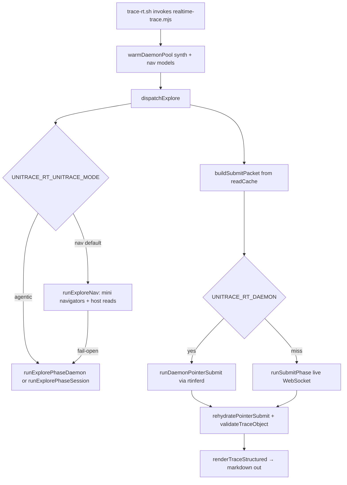

Tracing how `unitrace.sh` connects to the realtime tracer by searching the codebase for the entry script and realtime handoff points.
Reading the main function in `realtime-trace.mjs` and checking how the skill exposes `unitrace.sh`.
## Handoff chain

The default deep trace path is a three-layer pipeline:

**`unitrace.sh` → `trace-rt.sh` → `realtime-trace.mjs`**

Documented in `skills/unitrace/scripts/AGENTS.md` and `skills/unitrace/AGENTS.md`.

---

### Layer 1: `unitrace.sh` — thin env wrapper

`unitrace.sh` does not talk to the Realtime API itself. It `exec`s `trace-rt.sh` with default reasoning knobs for explore vs submit:

```12:15:skills/unitrace/scripts/unitrace.sh
exec env \
  UNITRACE_RT_UNITRACE_REASONING_EFFORT="${UNITRACE_RT_UNITRACE_REASONING_EFFORT:-none}" \
  UNITRACE_RT_SUBMIT_REASONING_EFFORT="${UNITRACE_RT_SUBMIT_REASONING_EFFORT:-low}" \
  "$SCRIPT_DIR/trace-rt.sh" "$@"
```

- Explore: reasoning omitted (`none`) + steer
- Submit: reasoning `low`

All arguments (the quoted question) pass through unchanged.

---

### Layer 2: `trace-rt.sh` — shell orchestrator

`trace-rt.sh` owns preflight, run state, prompt assembly, and the Node handoff.

**Preflight**

- Requires `node` and Codex OAuth at `~/.codex/auth.json`
- Blocks recursive invocation when `UNITRACE_INSIDE_TRACE_DAEMON=1` (set before calling Node)
- Creates an isolated run dir under `~/.cache/explore/runs` (or `UNITRACE_RUNS_DIR`)

**Prompt + map assembly**

1. Builds an explore prompt (use `explore_exec`, read load-bearing code, do not answer yet)
2. Builds a submit prompt (structured `submit_trace` schema)
3. Optionally generates a repo map via `map.mjs` (`UNITRACE_MAP_MODE`, default `tandem`) and appends it to the explore prompt
4. Appends `QUESTION: …` to the explore prompt

**The actual handoff** — constructs CLI args and runs Node:

```378:397:skills/unitrace/scripts/trace-rt.sh
RT_ARGS=(
  --prompt-file "$PROMPT_FILE"
  --map-file "$MAP_FILE"
  --question "$QUESTION"
  --workspace "$WORKSPACE"
  --out "$TMP_OUT"
  --raw "$TMP_RAW"
  --err "$ERR_FILE"
  --model "$MODEL"
  --auth-path "$CODEX_AUTH"
  --frames "$RUN_DIR/frames.ndjson"
)

RT_ARGS+=(--submit-prompt-file "$SUBMIT_PROMPT_FILE" --structured-out "$STRUCTURED_JSON")
if [ "${UNITRACE_WIRE_FORMAT:-0}" = "1" ]; then
  RT_ARGS+=(--wire 1)
fi

trace_status=0
node "$SCRIPT_DIR/realtime-trace.mjs" "${RT_ARGS[@]}" || trace_status=$?
```

After Node returns, `trace-rt.sh` copies output into `out.md`, writes `structured.json`, updates `status.json`, and optionally hydrates citations via `explore-hydrate.sh`.

---

### Layer 3: `realtime-trace.mjs` — Realtime tracer

**Entry: `main()`**

Parses the CLI flags from `trace-rt.sh`, reads prompt files, and dispatches:

```1233:1293:skills/unitrace/scripts/realtime-trace.mjs
async function main() {
  const promptFile = argValue("--prompt-file");
  ...
  const model = argValue("--model", process.env.UNITRACE_RT_MODEL || "gpt-realtime-2");
  const authPath = argValue("--auth-path", process.env.UNITRACE_CODEX_AUTH_PATH);
  ...
  if (wire) {
    result = await runWireStructuredTrace({ ... });
  } else {
    result = await runStructuredTrace({ ... });
  }
```

Default path: `runStructuredTrace()` (not wire mode).

**Two-phase trace inside `runStructuredTrace()`**



1. **Warm pools** — `warmDaemonPool()` for synth (`gpt-realtime-2`) and nav (`gpt-realtime-mini`) models via `lib/daemon-client.mjs` → shared `rtinferd` loopback daemon.

2. **Explore** — `dispatchExplore()` routes by `UNITRACE_RT_UNITRACE_MODE` (default `nav`):

```587:640:skills/unitrace/scripts/realtime-trace.mjs
async function dispatchExplore({ model, ensureSession, ...args }) {
  const mode = UNITRACE_RT_UNITRACE_MODE;
  if (mode !== "nav" && mode !== "hybrid") {
    if (UNITRACE_RT_DAEMON) {
      const daemonStats = await runExplorePhaseDaemon(model, args);
      if (daemonStats) return daemonStats;
    }
    return runExplorePhaseSession(await ensureSession(), args);
  }

  const navStats = await runExploreNav({ ... });
  if (!navStats) {
    // fail-open → agentic explore
    ...
  }
  ...
}
```

   - **`nav` (default):** `lib/rt-explore-nav.mjs` — host seeds reads, fans out 8 parallel `gpt-realtime-mini` navigators over the daemon pool; host greps/reads into `readCache`.
   - **`agentic`:** `runExplorePhaseDaemon()` (via `rtinferd`) or fallback `runExplorePhaseSession()` — live Realtime WebSocket with `explore_exec` tool loop (`lib/rt-agent-session.mjs`, `lib/realtime_client.mjs`).

   Before/during explore, `seedExploreReads()` in `lib/rt-map-seed.mjs` prefetches files. For questions mentioning `unitrace`, it pins the handoff chain itself:

```90:96:skills/unitrace/scripts/lib/rt-map-seed.mjs
function traceSeedTargets(question) {
  const q = String(question || "").toLowerCase();
  const wantsUnitrace = /\bunitrace(?:\.sh)?\b/.test(q);
  const wantsTraceRt = /\btrace-rt(?:\.sh)?\b/.test(q) || /\brealtime-trace(?:\.mjs)?\b/.test(q) || /\btrace rt\b/.test(q);
  if (wantsUnitrace) return ["scripts/unitrace.sh", "scripts/trace-rt.sh", "scripts/realtime-trace.mjs"];
  if (wantsTraceRt) return ["scripts/trace-rt.sh", "scripts/realtime-trace.mjs"];
  return [];
}
```

3. **Submit** — `buildSubmitPacket()` assembles question, read index, tool log, and submit instructions. Then:
   - **Primary:** `runDaemonPointerSubmit()` — structured output over warm daemon (`daemonAsk()` in `lib/daemon-client.mjs`), pointer citations rehydrated by `lib/rt-rehydrate-submit.mjs`, validated by `lib/trace-schema.mjs`.
   - **Fallback:** `runSubmitPhase()` — same schema over a live Realtime WebSocket via `askStructured()` in `lib/realtime_client.mjs`.

4. **Output** — `renderTraceStructured()` → markdown written to `--out`; structured JSON to `--structured-out`; tool log to `--err`.

---

## What each layer contributes

| Layer | Role |
|---|---|
| `unitrace.sh` | User-facing entry; sets explore/submit reasoning defaults |
| `trace-rt.sh` | Auth, run dirs, repo map prefetch, prompt files, invokes Node, post-processes output |
| `realtime-trace.mjs` | Realtime explore + structured submit; daemon pool + WebSocket fallbacks |
| `lib/realtime_client.mjs` | Low-level Realtime WebSocket client |
| `lib/rt-agent-session.mjs` | Hot socket, prewarm, prune, reconnect |
| `lib/daemon-client.mjs` | Borrow warm sockets from `rtinferd` |
| `lib/rt-explore-nav.mjs` | Default fast explore (mini navigators) |
| `lib/rt-map-seed.mjs` | Host-side seed reads before explore |
| `lib/rt-rehydrate-submit.mjs` | Pointer submit rehydration |
| `lib/trace-schema.mjs` | Submit validation |

---

## Direct entry

You can skip `unitrace.sh` and call `trace-rt.sh` directly (same Node handoff). `unitrace.sh` only adds the reasoning-effort defaults documented in its header.

For your exact question (“How does unitrace.sh hand off to the realtime tracer?”), the answer in one sentence: **`unitrace.sh` execs `trace-rt.sh` with reasoning env vars; `trace-rt.sh` builds prompts/map/state and runs `node realtime-trace.mjs`, which performs the two-phase gpt-realtime-2 trace (explore then structured submit) over the warm daemon pool with WebSocket fail-open fallbacks.**
