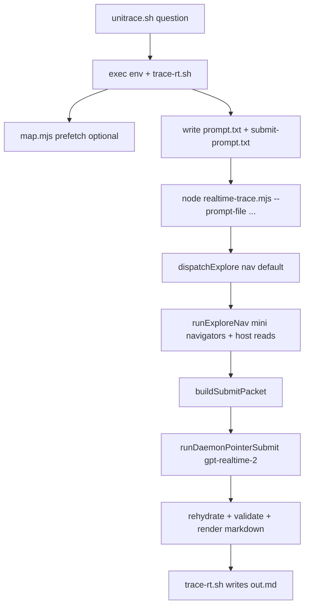

Tracing how `unitrace.sh` connects to the realtime tracer by locating the script and following its call chain.
Reading `realtime-trace.mjs` entry point and main orchestration:
## Handoff chain

The default deep trace path is a three-layer stack:

**`unitrace.sh` → `trace-rt.sh` → `realtime-trace.mjs`**

Documented in `skills/unitrace/scripts/AGENTS.md` and `skills/unitrace/AGENTS.md`.

---

### 1. `unitrace.sh` — thin env wrapper + `exec`

`unitrace.sh` does not talk to the Realtime API itself. It sets explore/submit reasoning defaults and **replaces the shell process** with `trace-rt.sh`, forwarding all arguments:

```12:15:skills/unitrace/scripts/unitrace.sh
exec env \
  UNITRACE_RT_UNITRACE_REASONING_EFFORT="${UNITRACE_RT_UNITRACE_REASONING_EFFORT:-none}" \
  UNITRACE_RT_SUBMIT_REASONING_EFFORT="${UNITRACE_RT_SUBMIT_REASONING_EFFORT:-low}" \
  "$SCRIPT_DIR/trace-rt.sh" "$@"
```

- Explore: reasoning **omitted** (`none`) + steer on user turns
- Submit: reasoning **`low`**

Those env vars are read later inside `realtime-trace.mjs` (`UNITRACE_RT_UNITRACE_REASONING_EFFORT`, `UNITRACE_RT_SUBMIT_REASONING_EFFORT`).

---

### 2. `trace-rt.sh` — run orchestration + Node invocation

`trace-rt.sh` is where the shell → realtime tracer handoff happens. It:

1. **Preflight** — requires Node, Codex OAuth at `~/.codex/auth.json`, a quoted question (no flags after it).
2. **Run state** — creates an isolated run dir under `~/.cache/explore/runs` (or `UNITRACE_RUNS_DIR`), writes `status.json`, `running`, etc.
3. **Prompt assembly** — builds explore and submit prompt text files, optionally prefetches a repo map via `map.mjs` (`UNITRACE_MAP_MODE`, default `tandem`), appends `QUESTION: …` to the explore prompt.
4. **Sets guard env** — `UNITRACE_INSIDE_TRACE_DAEMON=1` blocks recursive trace calls from inside `explore_exec`.
5. **Invokes the tracer** — the actual handoff:

```378:397:skills/unitrace/scripts/trace-rt.sh
RT_ARGS=(
  --prompt-file "$PROMPT_FILE"
  --map-file "$MAP_FILE"
  --question "$QUESTION"
  --workspace "$WORKSPACE"
  --out "$TMP_OUT"
  --raw "$TMP_RAW"
  --err "$ERR_FILE"
  --model "$MODEL"
  --auth-path "$CODEX_AUTH"
  --frames "$RUN_DIR/frames.ndjson"
)

RT_ARGS+=(--submit-prompt-file "$SUBMIT_PROMPT_FILE" --structured-out "$STRUCTURED_JSON")
if [ "${UNITRACE_WIRE_FORMAT:-0}" = "1" ]; then
  RT_ARGS+=(--wire 1)
fi

trace_status=0
node "$SCRIPT_DIR/realtime-trace.mjs" "${RT_ARGS[@]}" || trace_status=$?
```

6. **Post-process** — on success, moves output to `out.md`, marks `done`, optionally hydrates wire-format output via `explore-hydrate.sh`; on failure, writes `err.log` and exits 1.

Default model: `gpt-realtime-2` (`UNITRACE_RT_MODEL`).

---

### 3. `realtime-trace.mjs` — two-phase Realtime trace

Entry point `main()` parses CLI args, reads the prompt files `trace-rt.sh` wrote, and runs the pipeline:

```1233:1293:skills/unitrace/scripts/realtime-trace.mjs
async function main() {
  const promptFile = argValue("--prompt-file");
  // ...
  const explorePrompt = readFileSync(promptFile, "utf8");
  const submitInstructions = submitPromptFile ? readFileSync(submitPromptFile, "utf8") : "";
  // ...
  result = await runStructuredTrace({
    explorePrompt,
    submitInstructions,
    question,
    mapBlock: mapBlockFromFile,
    workspace,
    model,
    authPath,
    // ...
  });
```

#### Phase A — Explore (`dispatchExplore`)

Default mode is **`nav`** (`UNITRACE_RT_UNITRACE_MODE`, set in `trace-rt.sh` header docs):

```587:640:skills/unitrace/scripts/realtime-trace.mjs
async function dispatchExplore({ model, ensureSession, ...args }) {
  const mode = UNITRACE_RT_UNITRACE_MODE;
  if (mode !== "nav" && mode !== "hybrid") {
    // agentic: daemon explore first, then live-session explore_exec loop
    ...
  }
  const navStats = await runExploreNav({ ... });
  if (!navStats) {
    // fail-open to agentic explore
    ...
  }
  ...
}
```

In **`nav`** mode (`lib/rt-explore-nav.mjs`):

- Host seeds reads via search-fast retriever + map seeding (`seedExploreReads`, `retrieveCandidates`)
- **8 parallel `gpt-realtime-mini` navigators** (via `daemonAskBatch` / warm pool) propose `grep_terms` + `read_paths`
- Host executes grep/read with `htools.mjs` (`toolReadRange`), fills `readCache` / `filesRead`
- mini never reads files directly; `gpt-realtime-2` is reserved for submit

Fail-open tiers: nav → agentic `explore_exec` loop (`runExplorePhaseSession` over `RtAgentSession` WebSocket) → daemon agentic (`runExplorePhaseDaemon`).

#### Phase B — Submit

After explore, `buildSubmitPacket()` assembles evidence (read index, excerpts, tool log). Submit path (default):

```1085:1127:skills/unitrace/scripts/realtime-trace.mjs
const usePointerSubmit =
  UNITRACE_RT_HOST_PASSAGES && UNITRACE_RT_SUBMIT_POINTER_INDEX && transport === "rt";
if (UNITRACE_RT_DAEMON && usePointerSubmit) {
  const daemonResult = await runDaemonPointerSubmit({ ... });
  if (daemonResult) {
    return { text: daemonResult.markdown, toolLog, structured: daemonResult.structured };
  }
}
// fallback: live-session submit via askStructured on the hot WebSocket
structured = await runSubmitPhase(submitSession.connection, { ... });
return { text: renderTraceStructured(workspace, structured), toolLog, structured };
```

- **Primary:** `runDaemonPointerSubmit` → `daemonAsk` on warm pool (`lib/daemon-client.mjs`), model `gpt-realtime-2`, reasoning `low`
- **Rehydration:** `rehydratePointerSubmit` (`lib/rt-rehydrate-submit.mjs`) turns pointer citations into full `code_passages`
- **Validation:** `validateTraceObject` (`lib/trace-schema.mjs`), one reask on failure
- **Fallback:** `runSubmitPhase` on the live Realtime session (`askStructured` in `lib/realtime_client.mjs`)

On startup, `runStructuredTrace` also **warms the daemon pool** concurrently with session connect (`warmDaemonPool`).

---

## End-to-end flow (this question)



For your exact question (“How does unitrace.sh hand off to the realtime tracer?”), the answer in the codebase is literally: **`unitrace.sh` execs `trace-rt.sh` with reasoning env defaults; `trace-rt.sh` builds prompts/run state and runs `node realtime-trace.mjs`; `realtime-trace.mjs` runs nav explore + daemon submit over the Realtime WebSocket / warm pool.**

---

## Key files and functions

| Role | File | Functions / notes |
|------|------|-------------------|
| User entry | `skills/unitrace/scripts/unitrace.sh` | `exec env … trace-rt.sh` |
| Shell orchestrator | `skills/unitrace/scripts/trace-rt.sh` | prompt/map assembly, `node realtime-trace.mjs` |
| Tracer core | `skills/unitrace/scripts/realtime-trace.mjs` | `main`, `runStructuredTrace`, `dispatchExplore`, `buildSubmitPacket`, `runDaemonPointerSubmit`, `runSubmitPhase` |
| Nav explore | `skills/unitrace/scripts/lib/rt-explore-nav.mjs` | `runExploreNav` |
| Map/seed reads | `skills/unitrace/scripts/lib/rt-map-seed.mjs` | `seedExploreReads`, `namedPathsFromQuestion` |
| Realtime WS | `skills/unitrace/scripts/lib/realtime_client.mjs` | `askStructured`, `realtimeReasoningConfig` |
| Session reuse | `skills/unitrace/scripts/lib/rt-agent-session.mjs` | `RtAgentSession` |
| Warm pool | `skills/unitrace/scripts/lib/daemon-client.mjs` | `warmDaemonPool`, `daemonAsk`, `daemonAskBatch` |
| Submit rehydrate | `skills/unitrace/scripts/lib/rt-rehydrate-submit.mjs` | `rehydratePointerSubmit`, `buildReadIndex` |
| Schema/validation | `skills/unitrace/scripts/lib/trace-schema.mjs` | `validateTraceObject`, pointer schemas |
| Output render | `skills/unitrace/scripts/lib/render-trace-structured.mjs` | `renderTraceStructured` |
